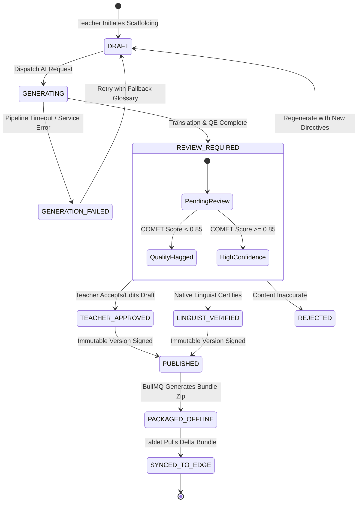
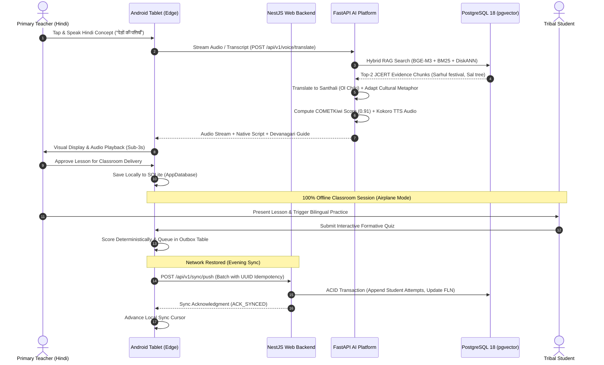

# 05 — DOMAIN MODEL & BOUNDED CONTEXT ARCHITECTURE

> **Document ID:** `BS-ARCH-05-DOMAIN-MODEL`  
> **Classification:** Enterprise System Architecture Control Document  
> **SIH Problem ID:** SIH26042 | **Domain:** Mother-Tongue-Based Multilingual Education (MTB-MLE)  
> **Pattern:** Strategic Domain-Driven Design (DDD) & Event-Driven Architecture  
> **Document Version:** 3.0.0-PROD | **Status:** Approved Baseline  

---

## 1. Strategic Domain-Driven Design (DDD) Bounded Context Map

The BhashaSetu AI platform is partitioned into six bounded contexts with strict boundaries and explicit context mapping:

```text
┌─────────────────────────────────────────────────────────────────────────────┐
│                         BOUNDED CONTEXT TOPOLOGY                            │
├─────────────────────────────────────────────────────────────────────────────┤
│                                                                             │
│  ┌───────────────────────────┐           ┌───────────────────────────────┐  │
│  │   IDENTITY & ACCESS       │           │   CURRICULUM & COMPETENCY     │  │
│  │   (Upstream Supplier)     │           │   (Core Generic Subdomain)    │  │
│  │   - User, SchoolTenant,   │           │   - CurriculumNode, LO,       │  │
│  │     Role, Session         │           │     TextbookChunk, Competency │  │
│  └─────────────┬─────────────┘           └───────────────┬───────────────┘  │
│                │ (Customer-Supplier)                     │ (Shared Kernel)  │
│                ▼                                         ▼                  │
│  ┌───────────────────────────────────────────────────────────────────────┐  │
│  │            SCAFFOLDING & PEDAGOGICAL CONTENT CONTEXT                  │  │
│  │            (Core Differentiating Subdomain)                           │  │
│  │   - Lesson (Aggregate Root), Adaptation, CulturalAnalogy,             │  │
│  │     Worksheet, FlashcardDeck                                          │  │
│  └─────────────────┬─────────────────────────────────────┬───────────────┘  │
│                    │ (Open Host Service)                 │ (Published Lang) │
│                    ▼                                     ▼                  │
│  ┌───────────────────────────┐           ┌───────────────────────────────┐  │
│  │   SPEECH & LANGUAGE       │           │   ASSESSMENT & FLN PROGRESS   │  │
│  │   (Supporting Subdomain)  │           │   (Supporting Subdomain)      │  │
│  │   - VoiceTurn, AudioAsset,│           │   - AssessmentQuiz, Student,  │  │
│  │     GlossaryTerm, Script  │           │     Attempt, FLNProgress      │  │
│  └───────────────────────────┘           └───────────────┬───────────────┘  │
│                                                          │                  │
│                                                          ▼                  │
│  ┌───────────────────────────────────────────────────────────────────────┐  │
│  │                   EDGE SYNCHRONIZATION CONTEXT                        │  │
│  │                   (Generic Infrastructure Subdomain)                  │  │
│  │   - OutboxOperation, SyncBatch, DeltaManifest, ConflictRecord         │  │
│  └───────────────────────────────────────────────────────────────────────┘  │
└─────────────────────────────────────────────────────────────────────────────┘
```

---

## 2. Aggregates, Entities, and Value Objects

### 2.1 Context 1: Scaffolding & Pedagogical Content (Core Domain)
- **Aggregate Root**: `Lesson`
  - **Entities**: `LessonSection`, `VisualFlashcard`, `BilingualWorksheet`
  - **Value Objects**:
    - `LessonId` (UUIDv4 prefixed with `LES-`)
    - `TargetLanguage` (`SANTHALI`, `HO`, `MUNDARI`)
    - `NativeScriptText` (Encapsulates Unicode character validation for Ol Chiki / Warang Chiti)
    - `PhoneticTransliteration` (Devanagari acoustic guide string)
    - `QualityScore` (Float between $0.0$ and $1.0$, COMETKiwi certified)
    - `CulturalAnalogy` (Local folk festival, regional flora/fauna referent)
  - **Invariants**:
    1. A `Lesson` cannot transition to `PUBLISHED` state without a `QualityScore` $\ge 0.80$ OR an explicit approval by an authenticated `TEACHER` or `LINGUIST`.
    2. A `Lesson` must be linked to at least one valid `LearningOutcomeCode` from the official JCERT hierarchy.

### 2.2 Context 2: Curriculum & Competency
- **Aggregate Root**: `CurriculumNode`
  - **Entities**: `Chapter`, `TextbookChunk`
  - **Value Objects**:
    - `LOCode` (e.g., `LO-EVS-G2-03`)
    - `GradeLevel` (`GRADE_1` through `GRADE_5`)
    - `Subject` (`MATHEMATICS`, `EVS`, `LANGUAGE_HINDI`)
    - `BloomLevel` (`REMEMBER`, `UNDERSTAND`, `APPLY`, `ANALYZE`)
    - `DenseEmbedding` (1024-dimensional float vector, BAAI/bge-m3 normalized)

### 2.3 Context 3: Assessment & FLN Progress
- **Aggregate Root**: `AssessmentQuiz`
  - **Entities**: `QuizQuestion`, `StudentAttempt`
  - **Value Objects**:
    - `QuestionId`, `AttemptId`
    - `Score` (Integer $0..100$)
    - `CompetencyStatus` (`EMERGING`, `DEVELOPING`, `PROFICIENT`)
    - `AttemptTimestamp` (ISO 8601 UTC)
  - **Invariants**:
    1. `StudentAttempt` records are strictly **append-only**. Edits and overwrites are forbidden.
    2. Quizzes must be deterministically evaluatable on the edge client without network calls.

### 2.4 Context 4: Edge Synchronization
- **Aggregate Root**: `SyncBatch`
  - **Entities**: `OutboxOperation`, `SyncLogEntry`, `ConflictDraft`
  - **Value Objects**:
    - `OperationId` (Client-generated UUIDv4 idempotency key)
    - `EntityName` (`lessons`, `assessments`, `students`)
    - `PayloadGzip` (Base64-encoded compressed JSON payload)
    - `SyncCursor` (Monotonically increasing sequence timestamp)

---

## 3. Core Business Workflow & State Transition Diagrams

### 3.1 Lesson Lifecycle State Machine


### 3.2 End-to-End Core Business Sequence Flow

