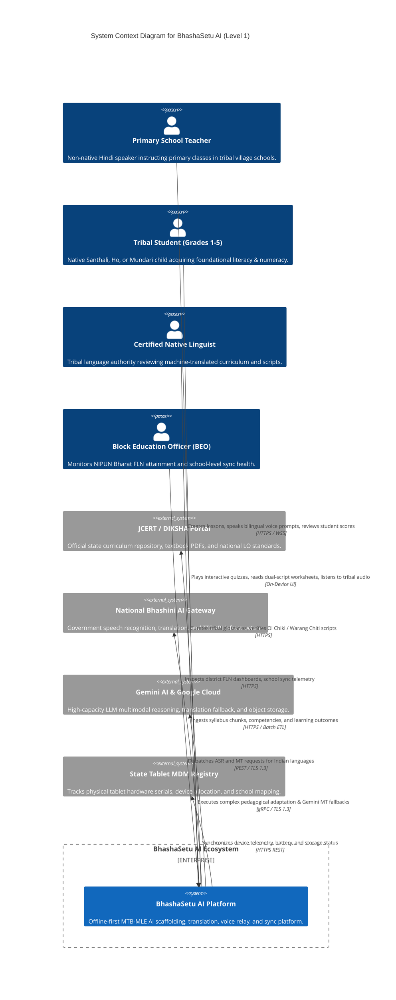

# 08 — C4 ARCHITECTURE MODEL: LEVEL 1 SYSTEM CONTEXT

> **Document ID:** `BS-ARCH-08-C4-CONTEXT`  
> **Classification:** Enterprise System Architecture Control Document  
> **SIH Problem ID:** SIH26042 | **Domain:** Mother-Tongue-Based Multilingual Education (MTB-MLE)  
> **Standard:** C4 Model for Visualizing Software Architecture (Level 1)  
> **Document Version:** 3.0.0-PROD | **Status:** Approved Baseline  

---

## 1. System Context Diagram (Level 1)

---

## 2. Actor Profile & Interface Specifications

| Actor | Access Medium | Primary Security Token | Core Operations |
|---|---|---|---|
| **Primary Teacher** | Android Tablet & Web Portal | JWT Bearer ($15\text{m}$ TTL) | `create_lesson`, `trigger_voice_relay`, `approve_draft`, `view_class_fln` |
| **Tribal Student** | Android Tablet (Shared/Single) | Pseudonymous `student_id` | `start_quiz`, `submit_attempt`, `listen_audio`, `view_flashcard` |
| **Native Linguist** | Web Frontend Desktop | RBAC Role: `LINGUIST` | `audit_translation`, `edit_glossary`, `certify_script`, `resolve_conflict` |
| **Block Admin (BEO)** | Web Frontend Desktop | RBAC Role: `DISTRICT_ADMIN` | `export_fln_report`, `view_sync_map`, `provision_school_tenant` |

---

## 3. External System Interfaces & Fallback Strategies

1. **JCERT / DIKSHA Curriculum Repository**:
   - **Protocol**: HTTPS REST / Periodic JSON & PDF data ingest.
   - **Fallback**: Pre-bundled local JCERT knowledge base in `services/ai-platform/rag/engine.py` ensures 100% autonomy even if state portals undergo maintenance.
2. **National Bhashini AI Gateway**:
   - **Protocol**: REST over TLS 1.3 with API Key Authentication.
   - **Fallback**: Seamlessly routes requests to local quantized NLLB-200 or Gemini 3.1 Pro if Bhashini latency exceeds $1500\text{ ms}$.
3. **Gemini AI & Google Cloud Platform**:
   - **Protocol**: HTTP/2 and gRPC client SDK.
   - **Fallback**: Quantized on-premises models (Distil-Whisper, Kokoro-82M, NLLB-200) run locally in Docker Compose with zero cloud egress.
4. **State Tablet MDM Registry**:
   - **Protocol**: HTTPS JSON Telemetry webhook.
   - **Fallback**: Tablet stores telemetry in local `sync_logs` table until administrative connection succeeds.
