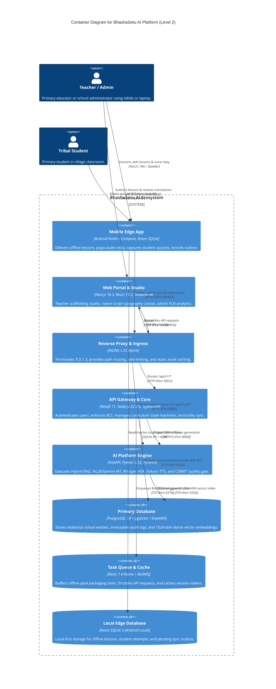

# 09 — C4 ARCHITECTURE MODEL: LEVEL 2 CONTAINER DIAGRAM

> **Document ID:** `BS-ARCH-09-C4-CONTAINER`  
> **Classification:** Enterprise System Architecture Control Document  
> **SIH Problem ID:** SIH26042 | **Domain:** Mother-Tongue-Based Multilingual Education (MTB-MLE)  
> **Standard:** C4 Model for Visualizing Software Architecture (Level 2)  
> **Document Version:** 3.0.0-PROD | **Status:** Approved Baseline  

---

## 1. Container Diagram (Level 2)

---

## 2. Container Responsibility & Specification Matrix

| Container Name | Runtime / Tech Stack | Port Binding | Docker / Path Mapping | Primary Responsibility |
|---|---|---|---|---|
| **Mobile Edge App** | Android Native (Kotlin 2.0, Compose, Room SQLite) | N/A (Embedded) | `app/` | Offline classroom UI, ExoPlayer audio playback, Silero VAD, local sync outbox engine. |
| **Local SQLite DB** | Room SQLite 3 (Android Filesystem) | In-process | Embedded in APK | Local system of record with 9 tables; zero network requirement. |
| **Web Frontend** | Next.js 16.3, React 19.2, TanStack Query | `3000:3000` (Dev: 3002) | `apps/web-frontend/` | Desktop Lesson Studio, Ol Chiki typography canvas, district analytics dashboards. |
| **Reverse Proxy** | NGINX Alpine | `80:80`, `443:443` | `infra/nginx/` | TLS termination, gzip compression, path routing, rate limiting. |
| **Web Backend** | NestJS 11, Node.js 22 LTS, TypeScript 5 | `3001:3001` | `services/web-backend/` | Central domain gateway, JWT/Argon2id auth, RLS tenant scoping, sync reconciliation. |
| **AI Platform** | FastAPI, Python 3.12, PyTorch | `8000:8000` | `services/ai-platform/` | Hybrid RAG (BGE-M3 + BM25), NLLB/Gemini translation, Kokoro TTS, COMET quality gate. |
| **PostgreSQL 18** | PostgreSQL 18 + `pgvector` / `pgvectorscale` | `5432:5432` | `infra/docker-compose.yml` | Unified relational store & DiskANN vector index for JCERT curriculum chunks. |
| **Redis 7.4** | Redis 7.4-Alpine | `6379:6379` | `infra/docker-compose.yml` | BullMQ task queue for offline pack generation, session caching, rate limiting. |
