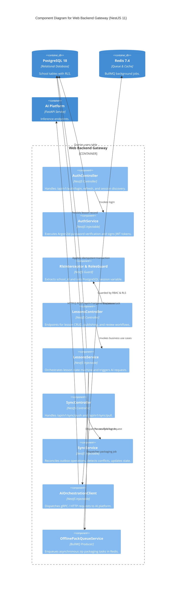
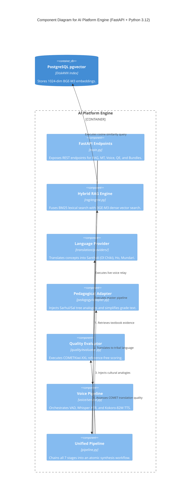
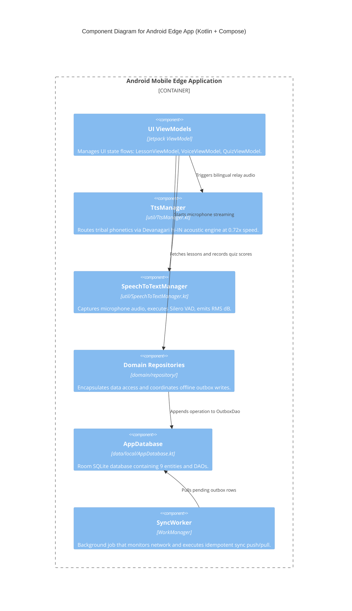

# 10 — C4 ARCHITECTURE MODEL: LEVEL 3 COMPONENT BREAKDOWN

> **Document ID:** `BS-ARCH-10-C4-COMPONENT`  
> **Classification:** Enterprise System Architecture Control Document  
> **SIH Problem ID:** SIH26042 | **Domain:** Mother-Tongue-Based Multilingual Education (MTB-MLE)  
> **Standard:** C4 Model for Visualizing Software Architecture (Level 3)  
> **Document Version:** 3.0.0-PROD | **Status:** Approved Baseline  

---

## 1. Web Backend Component Diagram (`services/web-backend/`)

---

## 2. AI Platform Component Diagram (`services/ai-platform/`)

---

## 3. Android Mobile Edge App Component Diagram (`app/`)

