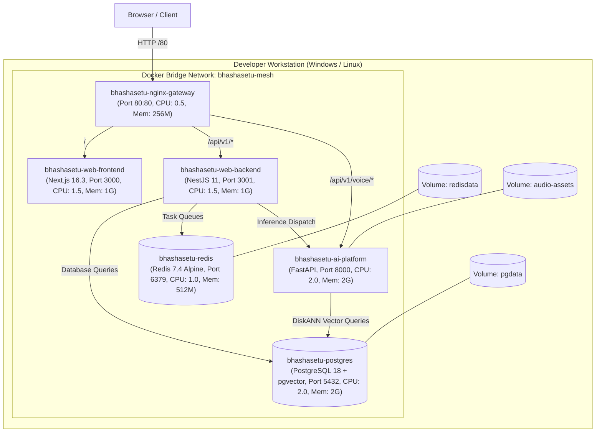
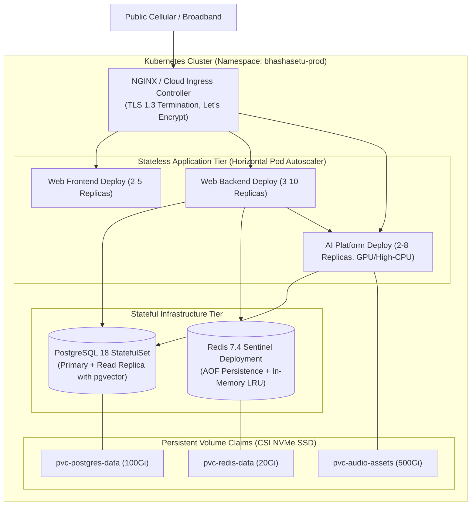

# 11 — C4 ARCHITECTURE MODEL: LEVEL 4 DEPLOYMENT TOPOLOGY

> **Document ID:** `BS-ARCH-11-C4-DEPLOYMENT`  
> **Classification:** Enterprise System Architecture Control Document  
> **SIH Problem ID:** SIH26042 | **Domain:** Mother-Tongue-Based Multilingual Education (MTB-MLE)  
> **Standard:** C4 Model for Visualizing Software Architecture (Level 4)  
> **Document Version:** 3.0.0-PROD | **Status:** Approved Baseline  

---

## 1. Local Development Multi-Container Mesh (`infra/docker-compose.yml`)

The complete platform runs locally in an isolated bridge network (`bhashasetu-mesh`) with strict resource constraints matching production bounds:

---

## 2. Production Kubernetes Cluster Topology (`infra/k8s/`)

For state-scale deployment across Jharkhand's 12,000 primary schools, BhashaSetu AI deploys to a managed Kubernetes cluster:

---

## 3. Container Resource Sizing & Limits Table

| Service Identifier | Kubernetes Pod Name | CPU Request / Limit | Memory Request / Limit | Autoscaling Rule (HPA) |
|---|---|---|---|---|
| `web-frontend` | `bhashasetu-web-frontend-*` | $500\text{m} / 1500\text{m}$ | $512\text{Mi} / 1024\text{Mi}$ | Target CPU $> 75\%$ or Memory $> 80\%$ |
| `web-backend` | `bhashasetu-web-backend-*` | $500\text{m} / 1500\text{m}$ | $512\text{Mi} / 1024\text{Mi}$ | Target CPU $> 70\%$ or Throughput $> 250\text{ rps}$ |
| `ai-platform` | `bhashasetu-ai-platform-*` | $1000\text{m} / 2000\text{m}$ | $1024\text{Mi} / 2048\text{Mi}$ | Target CPU $> 80\%$ (Optional T4 GPU slice) |
| `postgres` | `postgres-0` (StatefulSet) | $1000\text{m} / 2000\text{m}$ | $1024\text{Mi} / 2048\text{Mi}$ | Vertical Pod Autoscaler (VPA) |
| `redis` | `redis-*` | $250\text{m} / 1000\text{m}$ | $256\text{Mi} / 512\text{Mi}$ | Memory max bound at $512\text{MB}$ with LRU |
| `nginx-gateway` | `ingress-controller-*` | $250\text{m} / 500\text{m}$ | $128\text{Mi} / 256\text{Mi}$ | Cluster Ingress standard daemonset |
