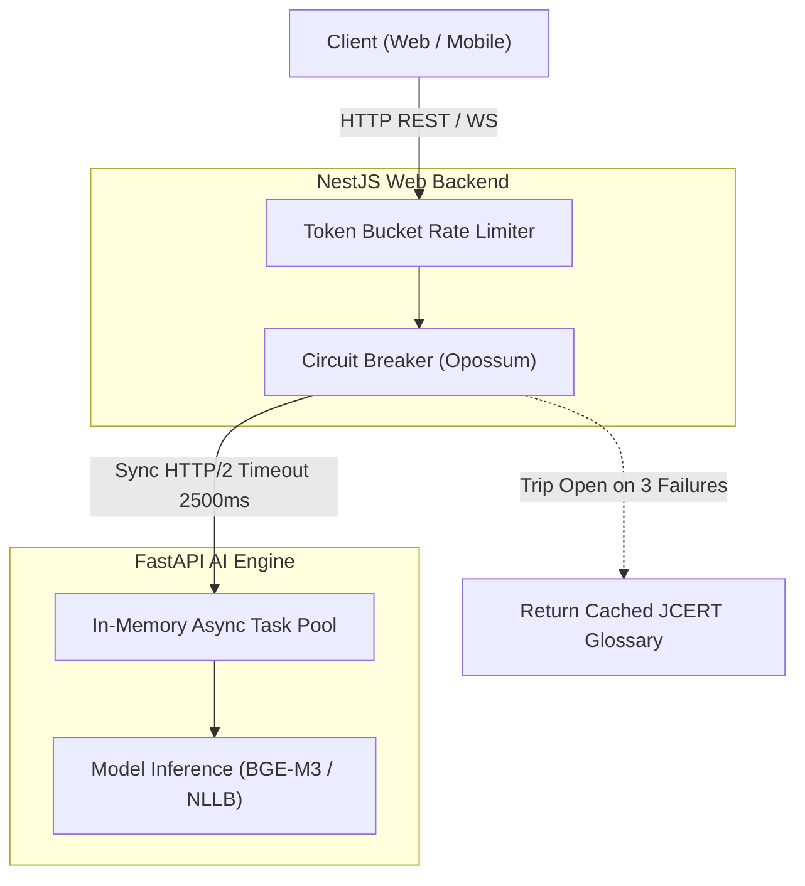

# 12 — MICROSERVICES ARCHITECTURE & SERVICE DECOUPLING

> **Document ID:** `BS-ARCH-12-SERVICES`  
> **Classification:** Enterprise System Architecture Control Document  
> **SIH Problem ID:** SIH26042 | **Domain:** Mother-Tongue-Based Multilingual Education (MTB-MLE)  
> **Pattern:** Pragmatic Modular Monolith + Specialized AI Engine Microservice  
> **Document Version:** 3.0.0-PROD | **Status:** Approved Baseline  

---

## 1. Service Boundary Justification & Decoupling Rationale

BhashaSetu AI avoids distributed-systems over-engineering by restricting service boundaries to distinct **runtime requirements** and **hardware constraints**:

```text
┌─────────────────────────────────────────────────────────────────────────────┐
│                    SERVICE DECOUPLING RATIONALE MATRIX                      │
├─────────────────────┬───────────────────┬───────────────────────────────────┤
│ Service             │ Runtime & Host    │ Why It Is Decoupled               │
├─────────────────────┼───────────────────┼───────────────────────────────────┤
│ 1. AI Platform      │ Python 3.12       │ PyTorch, Hugging Face, BGE-M3, and│
│    (FastAPI)        │ CUDA / CPU Worker │ ONNX runtimes require a native    │
│                     │                   │ Python runtime; Node.js lacks C++ │
│                     │                   │ tensor bindings of equal maturity.│
├─────────────────────┼───────────────────┼───────────────────────────────────┤
│ 2. Web Backend      │ Node.js 22 LTS    │ TypeScript enterprise gateway     │
│    (NestJS 11)      │ Linux Container   │ provides high-concurrency I/O,    │
│                     │                   │ strict RBAC/RLS, TypeORM, and     │
│                     │                   │ OpenAPI 3.1 contract generation.  │
├─────────────────────┼───────────────────┼───────────────────────────────────┤
│ 3. Web Frontend     │ Node.js / React 19│ Next.js App Router optimizes SSR, │
│    (Next.js 16.3)   │ Edge / Vercel/CDN │ bundle splitting, and desktop     │
│                     │                   │ Lesson Studio typography rendering│
├─────────────────────┼───────────────────┼───────────────────────────────────┤
│ 4. Mobile Edge App  │ Android ART / JVM │ Must execute 100% offline on low- │
│    (Kotlin Compose) │ ARM64 Physical    │ cost tablets; uses Room SQLite    │
│                     │                   │ and hardware audio drivers.       │
└─────────────────────┴───────────────────┴───────────────────────────────────┘
```

---

## 2. Service Dependency Matrix

```text
Downstream Service ──────────┐
                             │
Upstream Caller ▼            ▼   Web Backend   AI Platform   PostgreSQL   Redis   Android Edge
──────────────────────────────────────────────────────────────────────────────────────────────
Web Frontend                 │       YES            NO           NO         NO         NO
Web Backend                  │        --           YES          YES        YES         NO
AI Platform                  │        NO            --          YES        NO          NO
Android Edge (Online Sync)   │       YES           YES*          NO         NO         --
Android Edge (Offline Mode)  │        NO            NO           NO         NO         --
──────────────────────────────────────────────────────────────────────────────────────────────
* Android connects directly to AI Platform only for low-latency streaming voice relay; all
  other operations route through Web Backend.
```

---

## 3. Communication Patterns & Fault Tolerance



### Resilience Rules:
1. **Timeout Budgets**: Inter-service calls from Web Backend to AI Platform have a hard timeout of **$2500\text{ ms}$**. If the AI service fails to respond within $2500\text{ ms}$, the circuit breaker trips.
2. **Fallback Behavior**: When the AI circuit breaker trips, the system automatically falls back to static on-disk JCERT bilingual glossaries rather than failing the user request.
3. **Exponential Backoff**: Mobile outbox sync retries with exponential backoff and jitter:
   $$T_{\text{wait}} = \min\left(300\text{ s}, 2^{\text{attempt}} \times 1.5 + \text{rand}(0, 1)\right)$$
