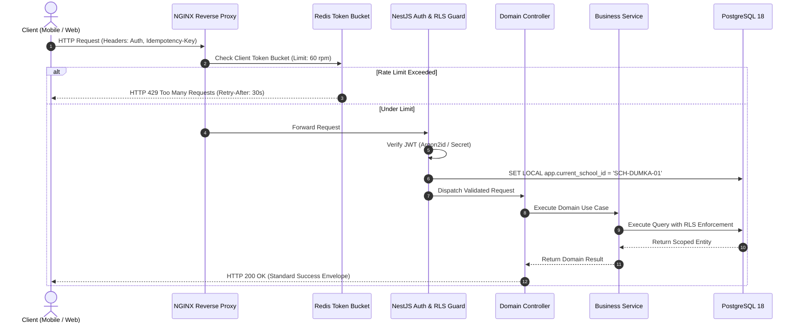

# 14 — API ARCHITECTURE & INTEGRATION STANDARDS

> **Document ID:** `BS-ARCH-14-API-ARCH`  
> **Classification:** Enterprise System Architecture Control Document  
> **SIH Problem ID:** SIH26042 | **Domain:** Mother-Tongue-Based Multilingual Education (MTB-MLE)  
> **Standard:** OpenAPI 3.1 & Cloud-Native RESTful Integration Standards  
> **Document Version:** 3.0.0-PROD | **Status:** Approved Baseline  

---

## 1. Global API Taxonomy & URL Standards

All endpoints across BhashaSetu AI adhere strictly to a deterministic URL hierarchy:

$$\text{https://}\{\text{domain}\}\text{/api/v1/}\{\text{bounded-context}\}\text{/}\{\text{resource}\}$$

* **Version Prefix**: Explicit `/api/v1/` in all paths to guarantee zero backwards-incompatibility breaks.
* **Plural Nouns**: Resources are pluralized (e.g., `/lessons`, `/quizzes`, `/worksheets`).
* **Kebab-case Sub-actions**: Verbs or specialized operations use kebab-case (e.g., `/generate-lesson`, `/voice/translate`, `/sync/push`).

---

## 2. Standardized JSON Envelope Schemas

### 2.1 Standard Success Envelope
```json
{
  "success": true,
  "data": {
    "lesson_id": "LES-A89F12BC",
    "status": "REVIEW_REQUIRED"
  },
  "metadata": {
    "timestamp": "2026-09-19T14:30:00Z",
    "request_id": "req-9b8c-4f12-a89f",
    "execution_ms": 142.5
  }
}
```

### 2.2 Standard Error Envelope (RFC 7807 Problem Details Compatible)
```json
{
  "success": false,
  "error": {
    "code": "ERR_RAG_NO_EVIDENCE",
    "message": "Curriculum context not found for this topic. Using foundational glossary.",
    "category": "AI_INFERENCE",
    "details": [
      {
        "field": "hindi_prompt",
        "issue": "Topic 'Quantum Computing' outside JCERT Grades 1-5 primary syllabus."
      }
    ],
    "recovery_action": "Fallback to primary JCERT glossary keywords."
  },
  "metadata": {
    "timestamp": "2026-09-19T14:30:01Z",
    "request_id": "req-9b8c-4f12-a89f"
  }
}
```

---

## 3. Idempotency & Header Invariants

Every mutating HTTP request (`POST`, `PUT`, `PATCH`, `DELETE`) originates with mandatory tracking headers:

| Header Name | Type | Mandatory? | Behavioral Contract |
|---|---|---|---|
| `X-Request-ID` | UUIDv4 | **YES** | Tracing ID passed through all microservices and logged in OpenTelemetry. |
| `Idempotency-Key` | UUIDv4 | **YES (Sync)** | Deduplication token; server caches receipt for 24h to prevent duplicate mutations. |
| `X-Device-ID` | UUIDv4 | **YES (Mobile)**| Unique tablet hardware serial or installation identifier. |
| `Authorization` | Bearer JWT | **YES (Auth)** | Signed JWT access token ($15\text{m}$ TTL) containing user identity and school RLS scope. |
| `Content-Encoding` | `gzip` | Optional | Mandatory for sync batches over 100 KB to conserve rural bandwidth. |

---

## 4. API Request Lifecycle Flow Diagram



---

## 5. Rate Limiting & Quota Specifications

* **Public Auth Endpoints** (`/api/v1/auth/login`): $5\text{ attempts per 5 minutes}$ per IP (prevents brute-force attacks).
* **AI Scaffolding Endpoints** (`/api/v1/ai/generate-lesson`): $20\text{ requests per minute}$ per school tenant.
* **Live Voice Relay Endpoints** (`/api/v1/voice/translate`): $60\text{ requests per minute}$ per active classroom tablet.
* **Sync Push/Pull Endpoints** (`/api/v1/sync/push`): $10\text{ requests per minute}$ per tablet (burst up to 20).
