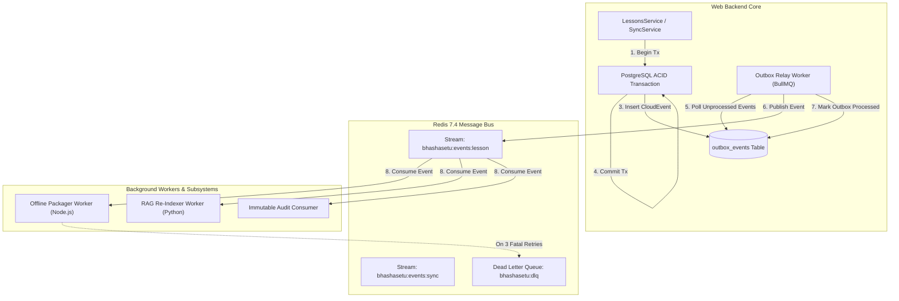

# 16 — EVENT-DRIVEN ARCHITECTURE & MESSAGE BUS SPECIFICATION

> **Document ID:** `BS-ARCH-16-EVENT-ARCH`  
> **Classification:** Enterprise System Architecture Control Document  
> **SIH Problem ID:** SIH26042 | **Domain:** Mother-Tongue-Based Multilingual Education (MTB-MLE)  
> **Standard:** CloudEvents 1.0 & Transactional Outbox Pattern  
> **Document Version:** 3.0.0-PROD | **Status:** Approved Baseline  

---

## 1. Domain Events vs. Integration Events

```text
┌─────────────────────────────────────────────────────────────────────────────┐
│                       EVENT CLASSIFICATION MATRIX                           │
├───────────────────┬──────────────────────┬──────────────────────────────────┤
│ Event Category    │ Scope & Transport    │ Primary Purpose                  │
├───────────────────┼──────────────────────┼──────────────────────────────────┤
│ 1. Domain Events  │ In-Process / Module  │ State transitions within bounded │
│                   │ NestJS EventEmitter2 │ context (e.g., LessonDraftCreated│
│                   │                      │ triggers validation rules).      │
├───────────────────┼──────────────────────┼──────────────────────────────────┤
│ 2. Integration    │ Cross-Service Bus    │ Replicates state across services │
│    Events         │ Redis BullMQ / HTTP  │ (e.g., LessonPublished triggers  │
│                   │ Transactional Outbox │ offline package zip compilation).│
└───────────────────┴──────────────────────┴──────────────────────────────────┘
```

---

## 2. CloudEvents 1.0 Standard Envelope Specification

Every asynchronous event emitted across the BhashaSetu messaging mesh adheres strictly to the CNCF CloudEvents 1.0 specification:

```json
{
  "specversion": "1.0",
  "id": "evt-77a8-4c12-98bf-446655440000",
  "source": "bhashasetu://services/web-backend/lessons",
  "type": "in.gov.jh.bhashasetu.lesson.published.v1",
  "datacontenttype": "application/json",
  "time": "2026-09-19T14:30:00Z",
  "subject": "LES-4F9A12BD",
  "data": {
    "lesson_id": "LES-4F9A12BD",
    "version": 3,
    "school_id": "SCH-DUMKA-01",
    "target_language": "SANTHALI",
    "grade_level": "GRADE_2",
    "lo_code": "LO-EVS-G2-03",
    "approver_id": "USR-RAMESH-01",
    "quality_score": 0.91
  }
}
```

---

## 3. Transactional Outbox & Message Broker Topology



---

## 4. Delivery Semantics, Partitioning, and Dead Letter Queues

1. **At-Least-Once Delivery**: Events are guaranteed to be delivered at least once. Consumers must enforce idempotent deduplication by checking `evt.id` in a Redis key with a 7-day TTL (`SETNX event:consumed:{id} 1 EX 604800`).
2. **Partitioning Keys**: Events are partitioned by `school_id` to ensure strict FIFO ordering per school tenant.
3. **Poison Pill Handling & DLQ**:
   - Max delivery attempts: $3$ retries with exponential backoff ($5\text{s}, 25\text{s}, 125\text{s}$).
   - On the 4th consecutive failure, the payload is moved to `bhashasetu:dlq` alongside full error stack trace and alert sent to SRE on-call.
