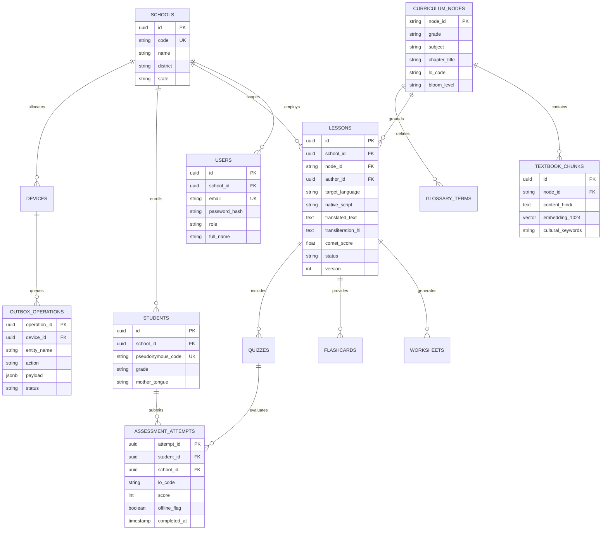

# 19 — DATABASE ENGINEERING: ERD, SCHEMAS & RLS POLICIES

> **Document ID:** `BS-ARCH-19-DB-ENGINEERING`  
> **Classification:** Enterprise System Architecture Control Document  
> **SIH Problem ID:** SIH26042 | **Domain:** Mother-Tongue-Based Multilingual Education (MTB-MLE)  
> **Source Grounding:** [`app/.../AppDatabase.kt`](file:///d:/HACKTHON/bhashasetu-ai/app/src/main/java/com/example/data/local/AppDatabase.kt) & [`services/web-backend/`](file:///d:/HACKTHON/bhashasetu-ai/services/web-backend)  
> **Document Version:** 3.0.0-PROD | **Status:** Approved Baseline  

---

## 1. Enterprise Entity-Relationship Diagram (ERD)



---

## 2. PostgreSQL 18 Production DDL & Vector Indexing

```sql
-- 1. Enable pgvector and cryptographic extensions
CREATE EXTENSION IF NOT EXISTS "uuid-ossp";
CREATE EXTENSION IF NOT EXISTS "vector";

-- 2. Schools (Tenants) Table
CREATE TABLE schools (
    id UUID PRIMARY KEY DEFAULT uuid_generate_v4(),
    code VARCHAR(32) UNIQUE NOT NULL,
    name VARCHAR(255) NOT NULL,
    district VARCHAR(64) NOT NULL,
    state VARCHAR(32) DEFAULT 'JHARKHAND',
    created_at TIMESTAMPTZ DEFAULT CURRENT_TIMESTAMP
);

-- 3. Users Table with Argon2id Password Hashes
CREATE TABLE users (
    id UUID PRIMARY KEY DEFAULT uuid_generate_v4(),
    school_id UUID REFERENCES schools(id) ON DELETE RESTRICT,
    email VARCHAR(255) UNIQUE NOT NULL,
    password_hash VARCHAR(255) NOT NULL,
    role VARCHAR(32) NOT NULL CHECK (role IN ('TEACHER', 'ADMIN', 'LINGUIST', 'DISTRICT_ADMIN')),
    full_name VARCHAR(128) NOT NULL,
    created_at TIMESTAMPTZ DEFAULT CURRENT_TIMESTAMP
);

-- 4. Curriculum Textbook Chunks with 1024-dim BGE-M3 Embeddings
CREATE TABLE textbook_chunks (
    id UUID PRIMARY KEY DEFAULT uuid_generate_v4(),
    chunk_id VARCHAR(64) UNIQUE NOT NULL,
    grade VARCHAR(16) NOT NULL,
    subject VARCHAR(64) NOT NULL,
    chapter_title VARCHAR(255) NOT NULL,
    lo_code VARCHAR(64) NOT NULL,
    content_hindi TEXT NOT NULL,
    cultural_keywords TEXT[] DEFAULT '{}',
    embedding vector(1024) NOT NULL,
    created_at TIMESTAMPTZ DEFAULT CURRENT_TIMESTAMP
);

-- StreamingDiskANN Vector Index for 10x RAM reduction & sub-6ms search
CREATE INDEX idx_textbook_chunks_embedding_diskann 
ON textbook_chunks 
USING diskann (embedding vector_cosine_ops)
WITH (num_neighbors = 64, search_list_size = 100);

-- 5. Lessons Table with Multi-Tenant RLS & HITL State
CREATE TABLE lessons (
    id UUID PRIMARY KEY DEFAULT uuid_generate_v4(),
    school_id UUID NOT NULL REFERENCES schools(id),
    author_id UUID REFERENCES users(id),
    target_language VARCHAR(32) NOT NULL CHECK (target_language IN ('SANTHALI', 'HO', 'MUNDARI')),
    grade VARCHAR(16) NOT NULL,
    subject VARCHAR(64) NOT NULL,
    lo_code VARCHAR(64) NOT NULL,
    hindi_prompt TEXT NOT NULL,
    native_script VARCHAR(32) NOT NULL,
    translated_text TEXT NOT NULL,
    transliteration_hindi TEXT NOT NULL,
    cultural_analogy TEXT,
    comet_score NUMERIC(4,3) NOT NULL,
    status VARCHAR(32) DEFAULT 'REVIEW_REQUIRED' CHECK (status IN ('DRAFT', 'GENERATING', 'REVIEW_REQUIRED', 'APPROVED', 'PUBLISHED')),
    version INT DEFAULT 1,
    checksum VARCHAR(64),
    created_at TIMESTAMPTZ DEFAULT CURRENT_TIMESTAMP,
    updated_at TIMESTAMPTZ DEFAULT CURRENT_TIMESTAMP
);

CREATE INDEX idx_lessons_school_lang ON lessons(school_id, target_language, grade);

-- 6. Student Assessment Attempts (Append-Only Audit)
CREATE TABLE assessment_attempts (
    attempt_id UUID PRIMARY KEY DEFAULT uuid_generate_v4(),
    school_id UUID NOT NULL REFERENCES schools(id),
    student_id UUID NOT NULL,
    quiz_id VARCHAR(64) NOT NULL,
    lo_code VARCHAR(64) NOT NULL,
    score INT NOT NULL CHECK (score >= 0 AND score <= 100),
    offline_flag BOOLEAN DEFAULT TRUE,
    client_timestamp TIMESTAMPTZ NOT NULL,
    synced_at TIMESTAMPTZ DEFAULT CURRENT_TIMESTAMP
);

CREATE INDEX idx_attempts_school_lo ON assessment_attempts(school_id, lo_code);
```

---

## 3. PostgreSQL Multi-Tenant Row-Level Security (RLS) Policies

```sql
-- Enable Row-Level Security on tenant-scoped tables
ALTER TABLE lessons ENABLE ROW LEVEL SECURITY;
ALTER TABLE assessment_attempts ENABLE ROW LEVEL SECURITY;

-- Lesson Policy: Users only see lessons belonging to their school
CREATE POLICY lesson_school_isolation_policy ON lessons
    FOR ALL
    TO bhashasetu_app_role
    USING (school_id = NULLIF(current_setting('app.current_school_id', true), '')::UUID);

-- Assessment Attempt Policy: School isolation
CREATE POLICY attempt_school_isolation_policy ON assessment_attempts
    FOR ALL
    TO bhashasetu_app_role
    USING (school_id = NULLIF(current_setting('app.current_school_id', true), '')::UUID);
```

---

## 4. Android Edge Client Room SQLite DDL (`AppDatabase.kt`)

The on-device database schema matches [`AppDatabase.kt`](file:///d:/HACKTHON/bhashasetu-ai/app/src/main/java/com/example/data/local/AppDatabase.kt) and operates in Write-Ahead Logging (WAL) mode:

```sql
-- 1. Local Lessons Table
CREATE TABLE IF NOT EXISTS local_lessons (
    lesson_id TEXT PRIMARY KEY NOT NULL,
    title_hindi TEXT NOT NULL,
    target_language TEXT NOT NULL,
    translated_text TEXT NOT NULL,
    transliteration_hindi TEXT NOT NULL,
    audio_path TEXT,
    sync_status TEXT NOT NULL DEFAULT 'SYNCED'
);

-- 2. Durable Outbox Queue Table (Client Idempotency Engine)
CREATE TABLE IF NOT EXISTS outbox_operations (
    operation_id TEXT PRIMARY KEY NOT NULL, -- UUIDv4 generated on device
    entity_name TEXT NOT NULL,              -- e.g. 'assessment_attempts'
    action TEXT NOT NULL,                   -- 'INSERT', 'UPDATE'
    payload TEXT NOT NULL,                  -- JSON stringified mutation
    created_at INTEGER NOT NULL,            -- Unix timestamp
    retry_count INTEGER NOT NULL DEFAULT 0,
    status TEXT NOT NULL DEFAULT 'PENDING'  -- 'PENDING', 'IN_FLIGHT', 'ACK_SYNCED'
);

-- 3. Local Assessment Attempts Table
CREATE TABLE IF NOT EXISTS local_assessment_attempts (
    attempt_id TEXT PRIMARY KEY NOT NULL,
    student_id TEXT NOT NULL,
    lo_code TEXT NOT NULL,
    score INTEGER NOT NULL,
    completed_at INTEGER NOT NULL,
    is_synced INTEGER NOT NULL DEFAULT 0
);
```
