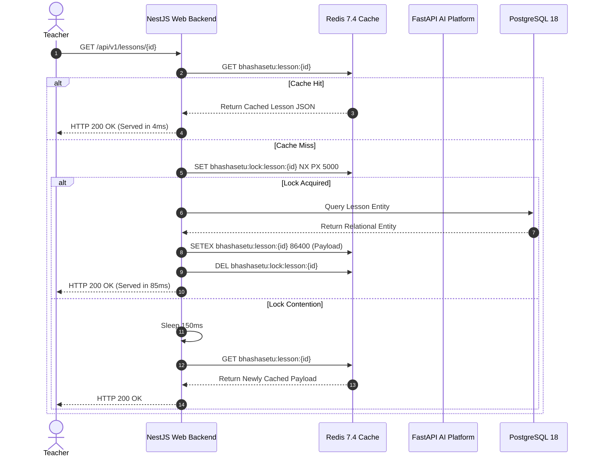

# 21 — CACHE ARCHITECTURE, TTL POLICIES & STAMPEDE DEFENSE

> **Document ID:** `BS-ARCH-21-CACHE-ARCH`  
> **Classification:** Enterprise System Architecture Control Document  
> **SIH Problem ID:** SIH26042 | **Domain:** Mother-Tongue-Based Multilingual Education (MTB-MLE)  
> **Implementation Grounding:** [`infra/docker-compose.yml:bhashasetu-redis`](file:///d:/HACKTHON/bhashasetu-ai/infra/docker-compose.yml) & [`services/ai-platform/main.py`](file:///d:/HACKTHON/bhashasetu-ai/services/ai-platform/main.py)  
> **Document Version:** 3.0.0-PROD | **Status:** Approved Baseline  

---

## 1. Multi-Tier Cache Hierarchy

BhashaSetu AI implements a **3-tier caching hierarchy** to protect backend databases and AI inference engines from redundant computation:

```text
┌─────────────────────────────────────────────────────────────────────────────┐
│                       MULTI-TIER CACHE TOPOLOGY                             │
├────────────────────┬────────────────────┬───────────────────────────────────┤
│ Cache Tier         │ Technology Stack   │ Scope & Target Entities           │
├────────────────────┼────────────────────┼───────────────────────────────────┤
│ Tier 1: Client Edge│ TanStack Query v5  │ Transient UI state, active lesson │
│                     │ Android Memory/Room│ draft, offline textbook syllabus. │
├────────────────────┼────────────────────┼───────────────────────────────────┤
│ Tier 2: Distributed│ Redis 7.4 Alpine   │ JWT session states, RAG vector    │
│ Server Cache       │ In-Memory LRU      │ results, rate limit token buckets.│
├────────────────────┼────────────────────┼───────────────────────────────────┤
│ Tier 3: Disk / CDN │ NGINX Ingress /    │ Compiled offline package zips,    │
│ Object Cache       │ Local Filesystem   │ static Kokoro synthesized audio.  │
└────────────────────┴────────────────────┴───────────────────────────────────┘
```

---

## 2. Cache Key Taxonomy & TTL Policies

All Redis keys adhere strictly to a hierarchical namespaced taxonomy:

$$\text{bhashasetu:}\{\text{subsystem}\}\text{:}\{\text{entity}\}\text{:}\{\text{identifier}\}$$

| Namespaced Key Pattern | Data Stored | TTL (Time-To-Live) | Eviction Policy | Invalidation Trigger |
|---|---|---|---|---|
| `bhashasetu:session:{user_id}` | JWT metadata & active school tenant | $15\text{ minutes}$ | `volatile-lru` | Logout or password reset |
| `bhashasetu:rag:query:{hash}` | Retrieved chunk IDs & similarity scores | $6\text{ hours}$ | `allkeys-lru` | Curriculum content re-indexed |
| `bhashasetu:glossary:{lang}:{hash}` | Term translation & script mapping | $24\text{ hours}$ | `allkeys-lru` | `glossary.updated.v1` event |
| `bhashasetu:ratelimit:{ip}:{minute}`| Token bucket request counter | $60\text{ seconds}$ | Automatic TTL | Fixed window expiration |
| `bhashasetu:lock:sync:{device_id}` | Distributed sync mutex lock | $30\text{ seconds}$ | Automatic TTL | Sync transaction completion |

---

## 3. Cache Stampede & Thundering Herd Defense

When thousands of tablets simultaneously request identical Grade 2 morning lessons, standard cache expiration can cause a **cache stampede** (thundering herd), crushing PostgreSQL and the AI microservice.

### Defense Mechanism: Probabilistic Early Expiration (XFetch Algorithm)
Instead of waiting for an absolute TTL expiration, background workers probabilistically recompute values when:

$$\Delta - \beta \cdot \epsilon \cdot \ln(\text{rand}()) > \text{TTL}$$

Where:
- $\Delta$: Time taken to compute the lesson or RAG query.
- $\beta > 0$: Aggressiveness parameter (configured to $1.2$).
- $\epsilon$: Remaining TTL.
- $\text{rand}()$: Uniform random variable $\in (0, 1)$.

### Distributed Mutex Lock (Redis `SETNX`):
If a cache miss occurs, only the first worker acquires a distributed lock to generate the lesson:
```text
SET bhashasetu:lock:lesson:LES-4F9A12BD "locked" NX PX 5000
```
All concurrent requests wait $100\text{ ms}$ and re-check the cache rather than triggering duplicate AI generation pipelines.

---

## 4. Cache Flow Sequence Diagram


