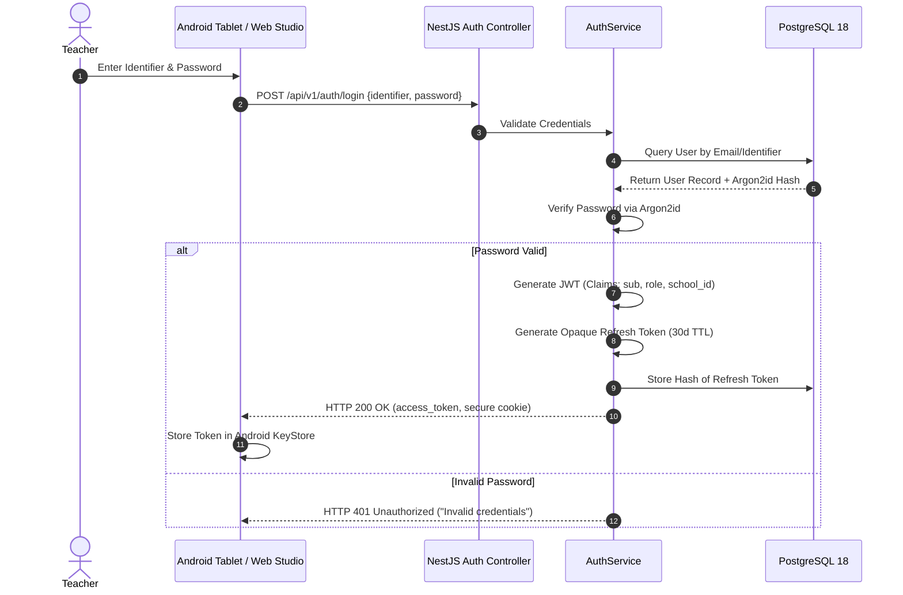

# 24 — AUTHENTICATION, AUTHORIZATION & SESSION SECURITY

> **Document ID:** `BS-ARCH-24-AUTH-SECURITY`  
> **Classification:** Enterprise System Architecture Control Document  
> **SIH Problem ID:** SIH26042 | **Domain:** Mother-Tongue-Based Multilingual Education (MTB-MLE)  
> **Source Grounding:** [`services/web-backend/src/auth/`](file:///d:/HACKTHON/bhashasetu-ai/services/web-backend) & [`app/.../UserProfileSheet.kt`](file:///d:/HACKTHON/bhashasetu-ai/app)  
> **Document Version:** 3.0.0-PROD | **Status:** Approved Baseline  

---

## 1. Authentication Architecture & Token Lifecycle

BhashaSetu AI implements an **asymmetric token lifecycle** balancing high cloud security with offline edge resilience:

```text
┌─────────────────────────────────────────────────────────────────────────────┐
│                          TOKEN LIFECYCLE TOPOLOGY                           │
├────────────────────┬────────────────────┬───────────────────────────────────┤
│ Token Type         │ Format & TTL       │ Storage Medium & Security Scope   │
├────────────────────┼────────────────────┼───────────────────────────────────┤
│ 1. Access Token    │ JWT (HMAC-SHA256)  │ Volatile Memory / Android Secure  │
│                    │ TTL: 15 Minutes    │ Storage. Encapsulates school_id.  │
├────────────────────┼────────────────────┼───────────────────────────────────┤
│ 2. Refresh Token   │ Opaque 64-char Hex │ HTTP-Only, Secure, SameSite Cookie│
│                    │ TTL: 30 Days       │ (Web) / EncryptedSharedPreferences│
├────────────────────┼────────────────────┼───────────────────────────────────┤
│ 3. Offline PIN /   │ PBKDF2 / SHA-256   │ Android KeyStore backed local     │
│    Biometric Hash  │ Local Validation   │ token for tablet classroom unlock.│
└────────────────────┴────────────────────┴───────────────────────────────────┘
```

---

## 2. Password Hashing Specification (Argon2id)

All server-side credentials stored in PostgreSQL 18 enforce the **Argon2id** password hashing algorithm (RFC 9106), calibrated to neutralize GPU/ASIC brute-force attacks:

$$\text{Argon2id}(P, S, m=65536, t=3, p=4)$$

Where:
- Memory size ($m$): **$64\text{ MB}$ ($65,536\text{ KiB}$)**.
- Iterations ($t$): **$3\text{ passes}$**.
- Parallelism ($p$): **$4\text{ threads}$**.
- Salt length: **$16\text{ bytes}$** cryptographically secure pseudorandom bytes (`crypto.randomBytes(16)`).

---

## 3. Role-Based Access Control (RBAC) Permission Matrix

```text
┌─────────────────────────────────────────────────────────────────────────────┐
│                         RBAC PERMISSIONS MATRIX                             │
├────────────────────────────┬─────────┬───────┬──────────┬───────────────────┤
│ Action / Resource          │ TEACHER │ ADMIN │ LINGUIST │ DISTRICT_OFFICER  │
├────────────────────────────┼─────────┼───────┼──────────┼───────────────────┤
│ Create Lesson Draft        │   YES   │  YES  │    NO    │        NO         │
│ Edit Lesson Adaptation     │   YES   │  YES  │   YES    │        NO         │
│ Approve Lesson for Publish │   YES   │  YES  │   YES    │        NO         │
│ Publish State Standard Pack│   NO    │  YES  │   YES    │        NO         │
│ Curate Central Glossary    │   NO    │  NO   │   YES    │        NO         │
│ View School FLN Analytics  │   YES   │  YES  │    NO    │        YES        │
│ View District-Wide Heatmap │   NO    │  NO   │    NO    │        YES        │
│ Push Mobile Outbox Batch   │   YES   │  NO   │    NO    │        NO         │
│ Delete School Record       │   NO    │  NO   │    NO    │   SYSTEM_SUPER    │
└────────────────────────────┴─────────┴───────┴──────────┴───────────────────┘
```

---

## 4. Authentication Flow Sequence Diagram


