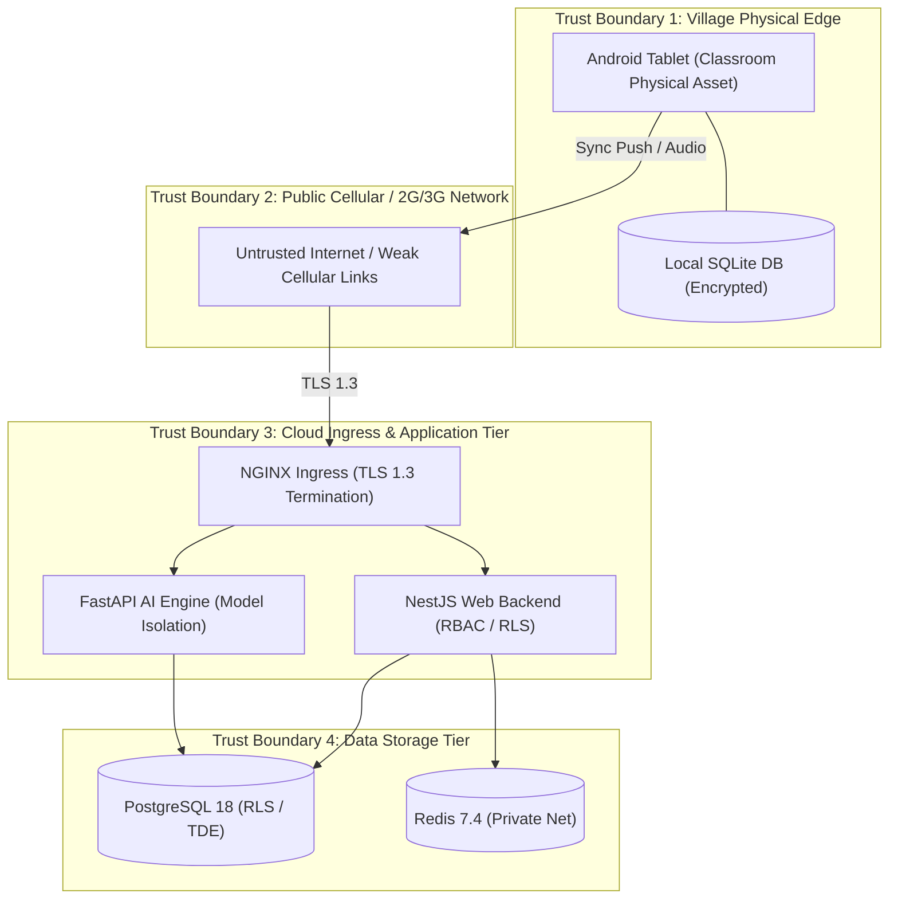

# 25 — STRIDE THREAT MODEL & RISK ASSESSMENTS

> **Document ID:** `BS-ARCH-25-THREAT-MODEL`  
> **Classification:** Enterprise System Architecture Control Document  
> **SIH Problem ID:** SIH26042 | **Domain:** Mother-Tongue-Based Multilingual Education (MTB-MLE)  
> **Methodology:** Microsoft STRIDE Threat Modeling Framework  
> **Document Version:** 3.0.0-PROD | **Status:** Approved Baseline  

---

## 1. System Trust Boundaries & Threat Surface

---

## 2. Exhaustive STRIDE Threat Analysis Matrix

| Threat Category | Target Subsystem | Concrete Threat Scenario | Severity | Applied Technical Mitigation | Residual Risk |
|---|---|---|---|---|---|
| **Spoofing** | API Gateway (`/sync/push`) | Attacker sends fabricated quiz batches posing as a rural school tablet. | **HIGH** | Mandatory `X-Device-ID` signed with device private key + school tenant mapping in DB. | LOW |
| **Tampering** | Local Tablet Database | Student or unauthorized user modifies SQLite scores using local debug tools. | **HIGH** | SQLCipher 256-bit AES encryption; APK compiled with ProGuard and debuggable=false. | LOW |
| **Repudiation** | Lesson Publishing | Teacher approves erroneous translation and later denies pedagogical responsibility. | **MEDIUM** | Cryptographic audit log (`audit_logs` table) permanently binds `user_id`, IP, and timestamp to version checksum. | ZERO |
| **Information Disclosure** | Cloud Core (Multi-Tenancy) | Educator from School A views student attempt records belonging to School B. | **CRITICAL** | PostgreSQL Row-Level Security (RLS) strictly enforced via `app.current_school_id`. | ZERO |
| **Denial of Service** | Live Voice API (`/voice/translate`) | Flaky script spams streaming voice requests, exhausting GPU/CPU inference threads. | **HIGH** | Redis Token Bucket rate limiting ($60\text{ rpm}$ per device) + Max 5s voice chunk timeout. | LOW |
| **Elevation of Privilege** | Web Portal RBAC | A teacher alters client-side JWT payload to claim `DISTRICT_ADMIN` privileges. | **CRITICAL** | JWT signature verified cryptographically via Argon2id secret; roles re-checked on every request. | ZERO |
| **AI Prompt Injection** | RAG Generation Engine | Malicious text in textbook input tricks model into generating inappropriate content. | **HIGH** | Strict XML delimiters (`<curriculum_evidence>`) isolate untrusted RAG chunks from system directives. | LOW |

---

## 3. Defense-in-Depth Implementation Checklist

1. **Root Detection on Android**: App inspects build tags (`test-keys`), `su` binaries, and Magisk paths. If rooted, offline database access is sandboxed with hardware KeyStore encryption.
2. **Network Security Config**: Android `res/xml/network_security_config.xml` strictly forbids cleartext HTTP traffic; enforces certificate pinning for all production API domains.
3. **Database Privilege Separation**: Web backend connects as restricted user `bhashasetu_app_role` without `SUPERUSER` or `CREATE TABLE` privileges; cannot bypass RLS policies.
