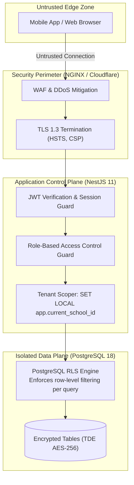

# 26 — SECURITY ARCHITECTURE, OWASP ASVS & TENANT ISOLATION

> **Document ID:** `BS-ARCH-26-SECURITY-ARCH`  
> **Classification:** Enterprise System Architecture Control Document  
> **SIH Problem ID:** SIH26042 | **Domain:** Mother-Tongue-Based Multilingual Education (MTB-MLE)  
> **Standard:** OWASP Application Security Verification Standard (ASVS 4.0 Level 2)  
> **Document Version:** 3.0.0-PROD | **Status:** Approved Baseline  

---

## 1. Zero-Trust Architectural Principles

BhashaSetu AI assumes zero trust across all network segments. Every request—whether originating from a remote tribal village tablet or an internal microservice—must be explicitly authenticated, authorized, and scoped before execution:



---

## 2. OWASP ASVS 4.0 Level 2 Compliance Mapping

| ASVS Category | Verification Requirement | Implementation in BhashaSetu AI | Compliance Status |
|---|---|---|---|
| **V1: Architecture** | Multi-tenant isolation verified at data layer | PostgreSQL Row-Level Security (RLS) policies on all tenant tables | **COMPLIANT** |
| **V2: Authentication** | Secure credential storage | Argon2id hashing with $64\text{ MB}$ memory cost and random salts | **COMPLIANT** |
| **V3: Session Mgmt** | Short-lived access tokens with secure storage | 15-minute JWT access tokens + HttpOnly, Secure, SameSite refresh cookies | **COMPLIANT** |
| **V4: Access Control** | Least privilege enforcement per endpoint | `@Roles('TEACHER')` NestJS guards; UI checks mirrored in controllers | **COMPLIANT** |
| **V5: Validation** | Strict input typing and sanitization | Pydantic v2 (FastAPI) and class-validator (NestJS) validation pipes | **COMPLIANT** |
| **V6: Cryptography** | Industry-standard encryption algorithms | AES-256-GCM for data at rest; TLS 1.3 with modern cipher suites | **COMPLIANT** |
| **V7: Error Handling** | Zero sensitive data leaks in error envelopes | RFC 7807 problem details; technical stack traces suppressed in production | **COMPLIANT** |
| **V8: Data Protection** | Anonymized child data | Pseudonymous student IDs; transient voice processing in volatile RAM | **COMPLIANT** |

---

## 3. Row-Level Security (RLS) Tenant Isolation Proof

To prove tenant isolation, the database interceptor executes the following transactional prologue before executing any application query:

```sql
-- 1. Inside transactional scope
BEGIN;

-- 2. Interceptor sets authenticated school tenant from verified JWT
SET LOCAL app.current_school_id = 'c7a84f12-0000-4444-8888-111122223333';

-- 3. Business query runs (RLS automatically appends WHERE school_id = '...')
SELECT id, title, target_language, comet_score FROM lessons;

-- 4. Even if an attacker injects "OR 1=1", the engine enforces:
-- ((school_id = current_setting('app.current_school_id')::UUID) AND (<user_clause>))

COMMIT;
```
If `app.current_school_id` is missing or invalid, the RLS policy evaluates to false and returns an empty dataset, preventing cross-tenant data leakage.
