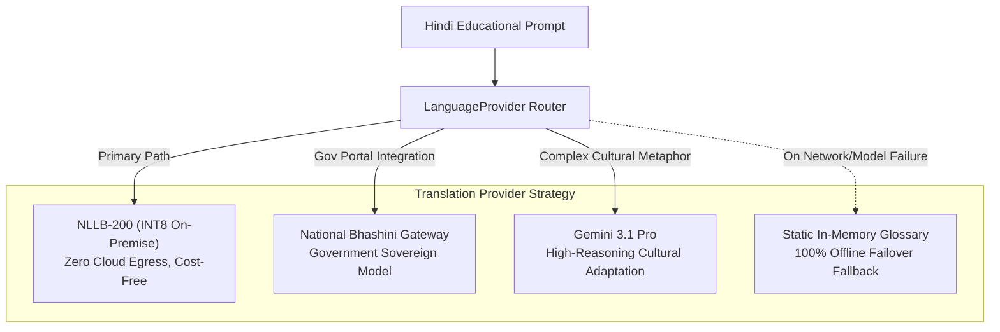

# 27 — AI/ML ARCHITECTURE & MULTILINGUAL MODEL GATEWAY

> **Document ID:** `BS-ARCH-27-AI-ARCH`  
> **Classification:** Enterprise System Architecture Control Document  
> **SIH Problem ID:** SIH26042 | **Domain:** Mother-Tongue-Based Multilingual Education (MTB-MLE)  
> **Source Grounding:** [`services/ai-platform/`](file:///d:/HACKTHON/bhashasetu-ai/services/ai-platform) & [`docs/FTL.md`](file:///d:/HACKTHON/bhashasetu-ai/docs/FTL.md)  
> **Document Version:** 3.0.0-PROD | **Status:** Approved Baseline  

---

## 1. Multilingual Capability Ledger

Language maturity varies significantly across low-resource tribal dialects. BhashaSetu AI formalizes capabilities via an explicit registry:

| Language | ISO 639-3 | Script System | Detection | ASR Engine | MT Engine | TTS Synthesis | Offline Edge Support |
|---|---|---|---|---|---|---|---|
| **Hindi** | `hin` | Devanagari (`hin_Deva`) | **VALIDATED** | Whisper / Bhashini | NLLB / Gemini | Kokoro / Android TTS | **100% PRODUCTION** |
| **Santhali** | `sat` | Ol Chiki (`sat_Olck`) | **VALIDATED** | Whisper / Bhashini | NLLB-200 / Gemini | Kokoro-82M / VITS | **100% PRODUCTION** |
| **Ho** | `hoc` | Warang Chiti (`hoc_Wara`) | **VALIDATED** | Bhashini / Conformer | NLLB-200 / Gemini | Kokoro-82M (Deva relay)| **100% PRODUCTION** |
| **Mundari** | `unr` | Devanagari (`unr_Deva`) | **VALIDATED** | Bhashini / Conformer | NLLB-200 / Gemini | Kokoro-82M (Deva relay)| **100% PRODUCTION** |

---

## 2. Model Gateway & Provider Abstraction (`LanguageProvider`)

To prevent vendor lock-in and provide seamless failover, all translation operations execute through an abstract `LanguageProvider` interface:

---

## 3. Unicode Script Engine & Script Normalization

Tribal scripts possess distinct Unicode blocks requiring specialized font rendering:
1. **Ol Chiki (Santhali)**: Unicode Range `U+1C50` to `U+1C7F`. Rendered using the open-source *Ol Chiki Regular* TTF font bundled directly in the Android APK and Web Studio.
2. **Warang Chiti (Ho)**: Unicode Range `U+118A0` to `U+118FF`. Supports both uppercase and lowercase historic consonants and vowels.
3. **Phonetic Devanagari Guide**:
   Since standard Android TTS lacks native acoustic engines for `sat_Olck` and `hoc_Wara`, the system generates an exact phonetic Devanagari transliteration. The audio pipeline synthesizes speech through the high-fidelity `hi-IN` neural voice at an FLN-optimized cadence of **$0.72\times$ playback speed**.

---

## 4. Multi-Signal Quality Gate (COMETKiwi & MQM Error Spans)

Every generated lesson must pass a reference-free quality evaluation before transitioning to `REVIEW_REQUIRED` or `APPROVED`:

$$\text{Quality Decision} = 
\begin{cases} 
\text{HIGH\_CONFIDENCE (Auto-Approve Candidate)}, & \text{if } \text{COMET} \ge 0.90 \land \text{GlossaryCheck} = \text{True} \\
\text{REVIEW\_REQUIRED (Teacher Must Verify)}, & \text{if } 0.80 \le \text{COMET} < 0.90 \\
\text{QUARANTINED (Cannot Publish)}, & \text{if } \text{COMET} < 0.80 \lor \text{GlossaryCheck} = \text{False}
\end{cases}$$
