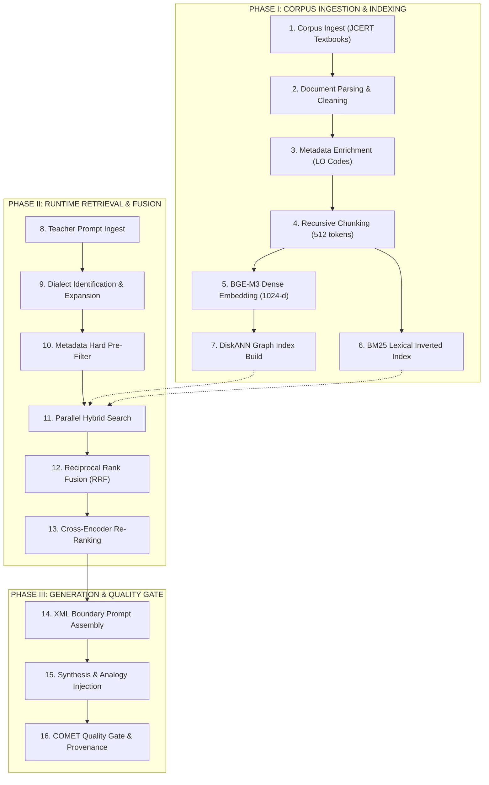

# 28 — HYBRID RAG ARCHITECTURE: THE 16-STAGE LIFECYCLE

> **Document ID:** `BS-ARCH-28-RAG-ARCH`  
> **Classification:** Enterprise System Architecture Control Document  
> **SIH Problem ID:** SIH26042 | **Domain:** Mother-Tongue-Based Multilingual Education (MTB-MLE)  
> **Source Grounding:** [`services/ai-platform/rag/`](file:///d:/HACKTHON/bhashasetu-ai/services/ai-platform/rag) & [`docs/TAD.md`](file:///d:/HACKTHON/bhashasetu-ai/docs/TAD.md)  
> **Document Version:** 3.0.0-PROD | **Status:** Approved Baseline  

---

## 1. The 16-Stage RAG Pipeline Lifecycle

BhashaSetu AI implements an end-to-end, 16-stage Retrieval-Augmented Generation lifecycle to ground educational content in official state syllabi:

---

## 2. Stage-by-Stage Engineering Specifications

### Stage 1–4: Ingestion, Parsing, Metadata & Chunking
- **Input**: JCERT Environmental Studies, Science, and Mathematics primary textbooks.
- **Parsing**: Strips page headers/footers, extracts section headings, and aligns tables.
- **Metadata**: Every chunk receives an explicit tuple: `(state_id, grade, subject, chapter, lo_code)`.
- **Chunking**: `RecursiveCharacterTextSplitter` with `chunk_size = 512`, `chunk_overlap = 64`.

### Stage 5–7: Dense & Sparse Indexing
- **Dense Embedding**: `BAAI/bge-m3` model produces 1024-dimensional normalized float vectors.
- **Sparse Index**: In-memory BM25 index with Hindi tokenization and tribal morphology stemming.
- **DiskANN Storage**: Inserted into PostgreSQL `textbook_chunks` table with `diskann` graph index.

### Stage 8–10: Query Processing & Filtering
- **Language Detection**: Determines whether the educator spoke standard Hindi or regional Khariboli.
- **Synonym Expansion**: Maps colloquial teacher phrases (e.g., *"पत्ता"*) to curriculum terms (*"पत्ती"*, *"सखुआ"*, *"साल वृक्ष"*).
- **Hard Pre-Filtering**: SQL query is constrained by `WHERE grade = 'GRADE_2' AND subject = 'EVS'`.

### Stage 11–13: Hybrid Retrieval, RRF & Re-ranking
- Parallel retrieval fetches Top-20 candidates from BM25 and Top-20 candidates from DiskANN.
- Merged via Reciprocal Rank Fusion ($k=60$).
- Cross-encoder reranks top 5 down to the **top 2 most grounded chunks**.

### Stage 14–16: Assembly, Synthesis & Quality Gate
- **XML Delimiting**: Chunks injected into LLM context inside `<curriculum_evidence>` tags to prevent prompt injection.
- **Cultural Injection**: Injects local analogies (e.g., Sarhul festival leaf rituals, Sal tree timber use).
- **Quality Gating**: Evaluates output with COMETKiwi. If score $\ge 0.85$, passes to lesson output.
