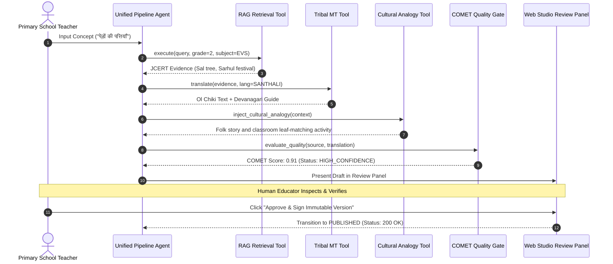

# 29 — AGENT ARCHITECTURE & HUMAN-IN-THE-LOOP GOVERNANCE

> **Document ID:** `BS-ARCH-29-AGENT-ARCH`  
> **Classification:** Enterprise System Architecture Control Document  
> **SIH Problem ID:** SIH26042 | **Domain:** Mother-Tongue-Based Multilingual Education (MTB-MLE)  
> **Pattern:** Autonomous Multi-Agent Synthesis with Strict Human-in-the-Loop (HITL)  
> **Document Version:** 3.0.0-PROD | **Status:** Approved Baseline  

---

## 1. Agent Autonomy Tiers & The HITL Safety Invariant

BhashaSetu AI strictly rejects unregulated autonomous agents in primary school education. All agent activities are compartmentalized into three autonomy tiers:

```text
┌─────────────────────────────────────────────────────────────────────────────┐
│                         AGENT AUTONOMY HIERARCHY                            │
├────────────────────┬──────────────────────┬─────────────────────────────────┤
│ Autonomy Tier      │ Permissions Granted  │ Scoped Agent Capabilities       │
├────────────────────┼──────────────────────┼─────────────────────────────────┤
│ Tier 1: Autonomous │ Fully Automated      │ • Real-time VAD voice framing   │
│ (Zero Review)      │ Zero Human Latency   │ • Deterministic quiz scoring    │
│                    │                      │ • In-memory cache lookups       │
├────────────────────┼──────────────────────┼─────────────────────────────────┤
│ Tier 2: Semi-Auto  │ Automated Draft,     │ • Lesson scaffolding generation │
│ (Quality Gated)    │ Quarantined Until    │ • Cultural analogy injection    │
│                    │ COMET Score >= 0.85  │ • Printable worksheet creation  │
├────────────────────┼──────────────────────┼─────────────────────────────────┤
│ Tier 3: Guarded    │ Human Approval       │ • Publishing lesson to offline  │
│ (Mandatory Human)  │ Strictly Mandatory   │ • Modifying central glossary    │
│                    │                      │ • Deploying school curriculum   │
└────────────────────┴──────────────────────┴─────────────────────────────────┘
```

---

## 2. Agent Execution & Tool Invocation Loop



---

## 3. Pedagogical Adaptation Engine (`pedagogy/adapter.py`)

The adaptation agent ensures that abstract educational concepts are mapped to rural tribal life:

1. **Environmental Grounding**:
   - Standard Textbook: *"Trees have green leaves that absorb sunlight."*
   - Adapted Tribal Scaffolding: *"Just as our parents gather fresh Sal (सखुआ) leaves during the Sarhul festival to honor nature, trees use their green leaves to drink sunshine and create food for the village forest."*
2. **Bloom's Taxonomy Simplification**:
   - Analyzes source vocabulary against an FLN Grade 1–2 readability index.
   - Replaces complex abstract Hindi terminology with native monosyllabic tribal roots.
