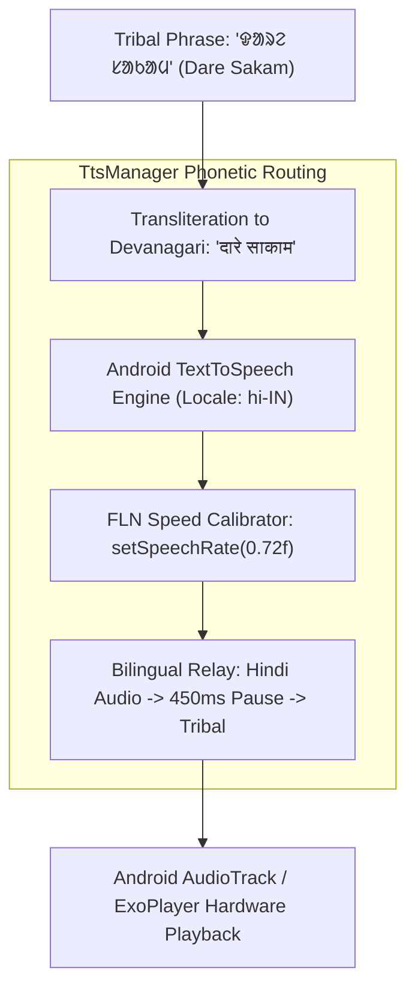

# 32 — MOBILE EDGE ARCHITECTURE: ANDROID COMPOSE & AUDIO PIPELINE

> **Document ID:** `BS-ARCH-32-MOBILE-ARCH`  
> **Classification:** Enterprise System Architecture Control Document  
> **SIH Problem ID:** SIH26042 | **Domain:** Mother-Tongue-Based Multilingual Education (MTB-MLE)  
> **Source Grounding:** [`app/src/main/java/com/example/`](file:///d:/HACKTHON/bhashasetu-ai/app/src/main/java/com/example) & [`AGENTS.md`](file:///d:/HACKTHON/bhashasetu-ai/AGENTS.md)  
> **Document Version:** 3.0.0-PROD | **Status:** Approved Baseline  

---

## 1. Mobile Edge Clean Architecture Blueprint

```text
app/src/main/java/com/example/
├── data/
│   ├── local/                      # Room SQLite Database (AppDatabase.kt), 9 DAOs
│   ├── remote/                     # Retrofit / OkHttp REST & WebSocket clients
│   └── repository/                 # Repository implementations coordinating local & remote
├── domain/
│   ├── model/                      # Clean domain entities (Lesson, Quiz, Student, Outbox)
│   └── repository/                 # Repository interfaces
└── ui/
    ├── screens/                    # Jetpack Compose UI (Lesson, Voice, Quiz, Glossary)
    ├── viewmodels/                 # AAC ViewModels managing reactive UI StateFlows
    └── util/
        ├── TtsManager.kt           # Tribal phonetic audio synthesis via hi-IN engine
        └── SpeechToTextManager.kt  # On-device Silero VAD & reactive RMS dB streaming
```

---

## 2. Speech & Audio Synthesis Pipeline (`TtsManager.kt`)

Because standard Android TTS engines lack native acoustic models for **Ol Chiki (Santhali)** or **Warang Chiti (Ho)**, [`TtsManager.kt`](file:///d:/HACKTHON/bhashasetu-ai/app/src/main/java/com/example/ui/util/TtsManager.kt) routes tribal phrases through a verified acoustic bridge:



### Audio Pipeline Invariants:
1. **Bilingual Relay Delivery**: The educator hears the standard Hindi sentence first, followed by an enforced **450ms silence**, and then the tribal mother-tongue translation.
2. **FLN Cadence**: Spoken tribal audio plays at **$0.72\times$ normal speed** to ensure Grade 1–2 children can parse phonemes clearly.
3. **Reactive StateFlows**: [`SpeechToTextManager.kt`](file:///d:/HACKTHON/bhashasetu-ai/app/src/main/java/com/example/ui/util/SpeechToTextManager.kt) exposes reactive state flows (`isListening`, `recognizedText`, `partialText`, `rmsDb`) allowing Compose visualizers to animate synchronously with speech.

---

## 3. Hardware Resource Constraints & JVM Memory Guardrails

To prevent fatal native memory exhaustion (`malloc failed` / `arena.cpp:168`) on low-cost tablets and Windows developer machines, `gradle.properties` enforces strict JVM memory bounds:

```properties
org.gradle.jvmargs=-Xmx2048m -XX:+UseG1GC -XX:MaxMetaspaceSize=512m
org.gradle.workers.max=2
org.gradle.parallel=true
```

### Production Build Metrics:
* **Target SDK**: Android 36.1 (Vanilla Android 14+ compatible down to Android 9.0 API 28).
* **Build Tools**: 36.0.0.
* **ProGuard / R8**: Minified code shrinking enabled.
* **APK Binary Size**: **$29.6\text{ MB}$** (`app-debug.apk`), fully deliverable over 2G cellular connections.
