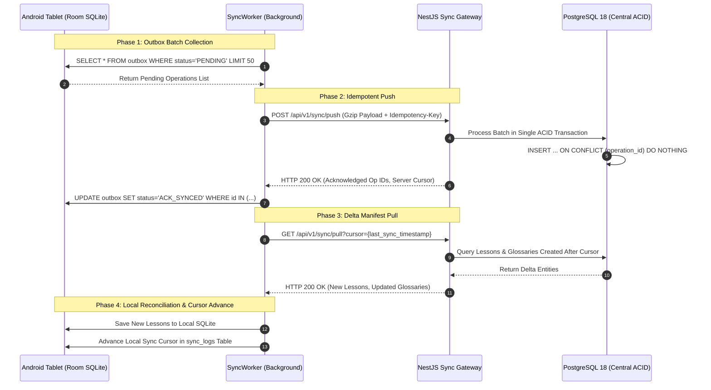

# 33 — DURABLE OFFLINE SYNCHRONIZATION & CONFLICT RECONCILIATION

> **Document ID:** `BS-ARCH-33-OFFLINE-SYNC`  
> **Classification:** Enterprise System Architecture Control Document  
> **SIH Problem ID:** SIH26042 | **Domain:** Mother-Tongue-Based Multilingual Education (MTB-MLE)  
> **Source Grounding:** [`services/web-backend/src/sync/`](file:///d:/HACKTHON/bhashasetu-ai/services/web-backend) & [`docs/FSD.md`](file:///d:/HACKTHON/bhashasetu-ai/docs/FSD.md)  
> **Document Version:** 3.0.0-PROD | **Status:** Approved Baseline  

---

## 1. The 4-Phase Durable Sync Protocol

To guarantee zero data loss across rural Jharkhand's intermittent 2G/3G links, synchronization executes via an atomic 4-phase protocol:

---

## 2. Deterministic Conflict Resolution Matrix

When concurrent edits occur across disconnected tablets or between cloud and edge, the system applies strict, deterministic policies rather than destructive last-write-wins:

| Entity Type | Conflict Scenario | Applied Policy | Technical Justification |
|---|---|---|---|
| **Published Lesson** | Concurrent edits on different classroom tablets | **IMMUTABLE_BRANCH** | Published educational content is immutable; conflicting edits spawn a local draft branch ($V_{N+1}$) for teacher review. |
| **Student Attempt** | Multiple submissions for identical quiz | **APPEND_ONLY** | Every attempt is preserved with its unique client UUID; historical progress tracking requires full audit fidelity. |
| **Teacher Review** | Automated AI score vs. human teacher edit | **TEACHER_AUTHORITATIVE** | The judgment of the human educator in the classroom strictly supersedes algorithmic model output. |
| **School Config** | Tablet local setting vs. District policy change | **SERVER_AUTHORITATIVE** | Administrative compliance and child safety policies must be uniformly enforced by central authorities. |

---

## 3. Exponential Backoff & Network Jitter Formulation

When the network drops mid-sync, the background worker reschedules the operation using exponential backoff with full jitter to prevent thundering herd spikes on cellular base stations:

$$T_{\text{sleep}} = \text{random\_between}\left(0, \, \min\left(M, \, B \cdot 2^{\text{attempt}}\right)\right)$$

Where:
- Base interval ($B$): **$1.5\text{ seconds}$**.
- Maximum ceiling ($M$): **$300.0\text{ seconds}$ ($5\text{ minutes}$)**.
- `attempt`: Consecutive network failure count (reset to $0$ on successful sync acknowledgment).
