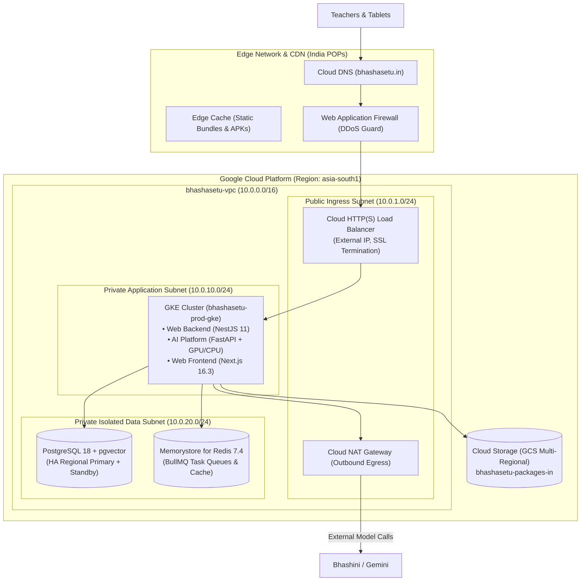

# 34 — CLOUD ARCHITECTURE & SOVEREIGN HOSTING BLUEPRINT

> **Document ID:** `BS-ARCH-34-CLOUD-ARCH`  
> **Classification:** Enterprise System Architecture Control Document  
> **SIH Problem ID:** SIH26042 | **Domain:** Mother-Tongue-Based Multilingual Education (MTB-MLE)  
> **Deployment Target:** Google Cloud Platform (GCP) / National Sovereign Cloud (MeitY Approved)  
> **Document Version:** 3.0.0-PROD | **Status:** Approved Baseline  

---

## 1. Cloud Provider & Sovereign Data Center Strategy

To comply with India's **Digital Personal Data Protection (DPDP) Act 2023** and Government of India Ministry of Electronics and Information Technology (MeitY) standards, all cloud infrastructure resides within the **India Sovereign Data Boundary** (`asia-south1` / Mumbai or `asia-south2` / Delhi):

```text
┌─────────────────────────────────────────────────────────────────────────────┐
│                       SOVEREIGN HOSTING BOUNDARY                            │
├────────────────────┬────────────────────┬───────────────────────────────────┤
│ Infrastructure Tier│ Target Platform    │ Configuration & SLA               │
├────────────────────┼────────────────────┼───────────────────────────────────┤
│ Primary Region     │ GCP asia-south1    │ Multi-Zone High Availability      │
│                    │ (Mumbai, India)    │ (Zones a, b, c). SLA: 99.95%      │
├────────────────────┼────────────────────┼───────────────────────────────────┤
│ DR / Backup Region │ GCP asia-south2    │ Asynchronous replica & snapshot   │
│                    │ (Delhi, India)     │ archive. RPO: < 15m, RTO: < 30m   │
├────────────────────┼────────────────────┼───────────────────────────────────┤
│ CDN & Edge Pop     │ Cloudflare / Fastly│ India-wide caching of static APKs,│
│                    │ Edge Locations     │ fonts, and offline package zips.  │
└────────────────────┴────────────────────┴───────────────────────────────────┘
```

---

## 2. Cloud Infrastructure Resource Topology


