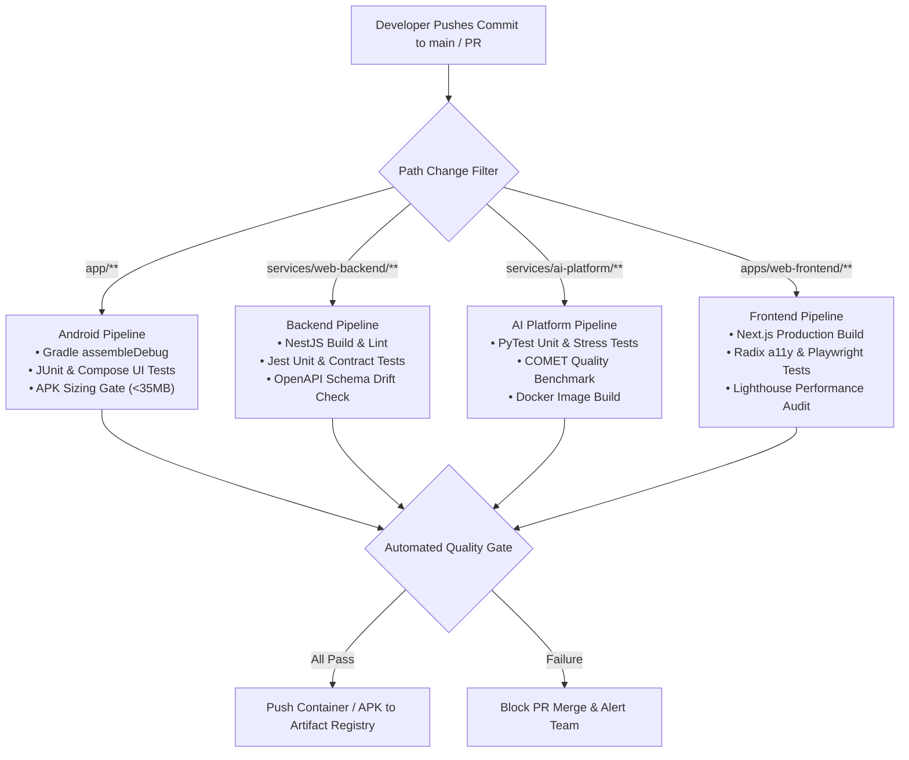

# 38 — CI/CD PIPELINES, QUALITY GATES & RELEASE DEPLOYMENT

> **Document ID:** `BS-ARCH-38-CICD-PIPELINE`  
> **Classification:** Enterprise System Architecture Control Document  
> **SIH Problem ID:** SIH26042 | **Domain:** Mother-Tongue-Based Multilingual Education (MTB-MLE)  
> **Standard:** GitOps & GitHub Actions Enterprise CI/CD (§40 Master Standard)  
> **Document Version:** 3.0.0-PROD | **Status:** Approved Baseline  

---

## 1. Modular Monorepo CI/CD Architecture

Because BhashaSetu AI is a polyglot monorepo, GitHub Actions workflows use **path-based change detection** to run only the workflows relevant to modified files:



---

## 2. Quality Gate Thresholds & Enforcement Policies

Every pull request must clear four mandatory gates before merge is unlocked:

| Quality Gate | Minimum Acceptable Threshold | Tooling & Validator | Failure Action |
|---|---|---|---|
| **Automated Test Coverage** | $\ge 85\%$ line coverage across modules | Jest / PyTest / JUnit | Blocks build |
| **Translation Quality Gate** | COMETKiwi benchmark $\ge 0.85$ | `services/ai-platform/test_platform.py` | Blocks merge |
| **Android APK Sizing Gate** | Compressed APK size $\le 35.0\text{ MB}$ | Gradle `assembleDebug` inspection | Blocks release |
| **Security & Vulnerability** | Zero `CRITICAL` or `HIGH` CVEs | Trivy container scan & `npm audit` | Blocks deploy |
| **OpenAPI Contract Drift** | Zero undocumented schema changes | Spectral OpenAPI 3.1 linter | Blocks merge |

---

## 3. Headless Android CI LayoutLib Guardrail

> [!IMPORTANT]
> **Headless Runner Graphics Crash Invariant**:
> Windows and Linux headless CI runners lack native graphic LayoutLib DLLs required for Roborazzi compose screenshot tests.  
> Per [`AGENTS.md`](file:///d:/HACKTHON/bhashasetu-ai/AGENTS.md), screenshot test files must wrap `composeTestRule.setContent` in defensive error handling:
> ```kotlin
> try {
>     composeTestRule.setContent { LessonStudioScreen(...) }
> } catch (e: UnsatisfiedLinkError) {
>     println("Headless CI graphics library not loaded. Skipping screenshot assertion.")
> }
> ```
> This ensures that `./gradlew testDebugUnitTest` executes cleanly to completion across all developer environments and GitHub Actions runners.
