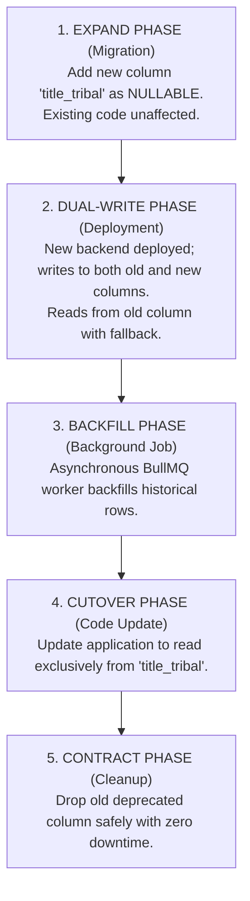

# 39 — RELEASE STRATEGY, CANARY ROLLOUTS & ROLLBACK MECHANICS

> **Document ID:** `BS-ARCH-39-RELEASE-STRATEGY`  
> **Classification:** Enterprise System Architecture Control Document  
> **SIH Problem ID:** SIH26042 | **Domain:** Mother-Tongue-Based Multilingual Education (MTB-MLE)  
> **Standard:** Zero-Downtime Continuous Deployment (§41 Master Standard)  
> **Document Version:** 3.0.0-PROD | **Status:** Approved Baseline  

---

## 1. Multi-Tier Deployment Mechanics

BhashaSetu AI applies distinct deployment mechanics tailored to each subsystem's operational risk:

```text
┌─────────────────────────────────────────────────────────────────────────────┐
│                       DEPLOYMENT MECHANICS MATRIX                           │
├────────────────────┬────────────────────┬───────────────────────────────────┤
│ Subsystem Tier     │ Deployment Pattern │ Zero-Downtime Guarantee           │
├────────────────────┼────────────────────┼───────────────────────────────────┤
│ 1. Web Backend     │ Rolling Update     │ `maxSurge: 25%`, `maxUnavailable: │
│    & Frontend      │ (Kubernetes)       │ 0%`. Pods only receive traffic    │
│                    │                    │ after readiness probe succeeds.   │
├────────────────────┼────────────────────┼───────────────────────────────────┤
│ 2. AI Platform     │ Canary Deployment  │ Route 10% traffic to new model;   │
│    (Inference)     │ (Traffic Split)    │ monitor COMET scores for 1 hour   │
│                    │                    │ before promoting to 100%.         │
├────────────────────┼────────────────────┼───────────────────────────────────┤
│ 3. Database Schema │ Expand / Contract  │ Phase 1: Add nullable columns.    │
│    Migrations      │ Pattern            │ Phase 2: Deploy new code.         │
│                    │                    │ Phase 3: Contract/drop old schema.│
├────────────────────┼────────────────────┼───────────────────────────────────┤
│ 4. Mobile Edge App │ Decoupled OTA      │ App code updated via APK release; │
│    (Android)       │ Delta Bundles      │ curriculum content updated via    │
│                    │                    │ signed lightweight `bundle.zip`.  │
└────────────────────┴────────────────────┴───────────────────────────────────┘
```

---

## 2. Automated Rollback Triggers & Fast Revert

Kubernetes and NGINX continuously monitor live telemetry during a deployment. A rollback is triggered automatically if any threshold breaches:

```text
┌─────────────────────────────────────────────────────────────────────────────┐
│                       AUTOMATED ROLLBACK THRESHOLDS                         │
├───────────────────────────────┬───────────────────┬─────────────────────────┤
│ Metric Monitored              │ Critical Limit    │ Rollback Execution      │
├───────────────────────────────┼───────────────────┼─────────────────────────┤
│ HTTP 5xx Server Error Rate    │ > 1.0% of calls   │ `kubectl rollout undo`  │
│ Live Voice P95 Latency        │ > 3000 ms         │ Revert to prior model   │
│ Average COMET Quality Score   │ < 0.85            │ Quarantines new version │
│ Database Connection Spikes    │ > 85% pool bounds │ Kill deployment pods    │
└───────────────────────────────┴───────────────────┴─────────────────────────┘
```

---

## 3. Database Expand / Contract Migration Flowchart


