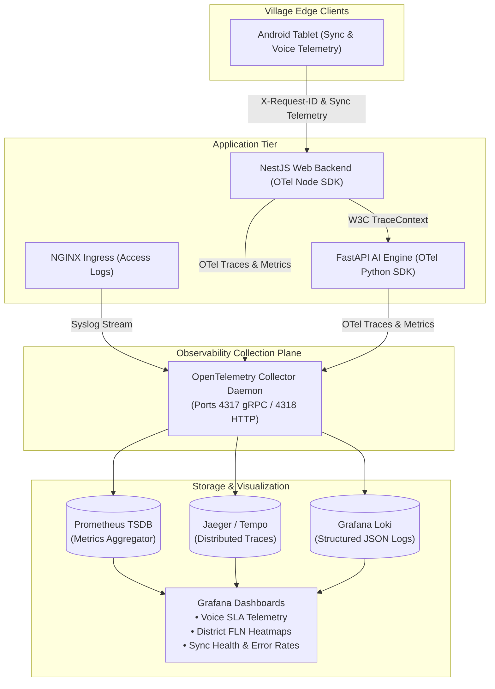

# 40 — OBSERVABILITY, DISTRIBUTED TRACING & TELEMETRY

> **Document ID:** `BS-ARCH-40-OBSERVABILITY`  
> **Classification:** Enterprise System Architecture Control Document  
> **SIH Problem ID:** SIH26042 | **Domain:** Mother-Tongue-Based Multilingual Education (MTB-MLE)  
> **Standard:** OpenTelemetry (OTel) & Prometheus/Grafana Cloud-Native Monitoring  
> **Document Version:** 3.0.0-PROD | **Status:** Approved Baseline  

---

## 1. Observability Data Flow Architecture



---

## 2. Key Metrics Catalog (Prometheus Format)

| Metric Identifier | Metric Type | Labels / Dimensions | SLI / Alert Significance |
|---|---|---|---|
| `bhashasetu_voice_relay_latency_ms` | Histogram | `step` (`vad`, `asr`, `mt`, `tts`), `lang` | **P0 SLI**: Alert if P95 total $> 3000\text{ ms}$. |
| `bhashasetu_rag_retrieval_ms` | Histogram | `grade`, `subject`, `engine` (`diskann`, `bm25`) | Alert if P95 retrieval $> 25\text{ ms}$. |
| `bhashasetu_comet_quality_score` | Histogram | `target_lang`, `provider` | Alert if rolling average drops $< 0.85$. |
| `bhashasetu_sync_operations_total` | Counter | `entity`, `status` (`success`, `conflict`) | Tracks edge replication throughput. |
| `bhashasetu_active_tablets_gauge` | Gauge | `district`, `state` | Monitors live connected classroom inventory. |
| `bhashasetu_cache_hit_ratio` | Gauge | `cache_name` (`redis`, `rag_lru`) | Alert if hit ratio drops $< 70\%$. |

---

## 3. Distributed Tracing & W3C TraceContext Invariant

All inter-service and edge transactions propagate **W3C TraceContext headers** (`traceparent`, `tracestate`):
```text
traceparent: 00-4bf92f3577b34da6a3ce929d0e0e4736-00f067aa0ba902b7-01
```

### End-to-End Span Hierarchy:
1. `span: mobile.voice_translate_request` (Client initiation)
   - `span: backend.gateway_proxy`
     - `span: ai.pipeline.synthesize`
       - `span: ai.rag.hybrid_retrieve` (Queries pgvector DiskANN)
       - `span: ai.mt.nllb_translate`
       - `span: ai.pedagogy.adapt_cultural_analogy`
       - `span: ai.quality.evaluate_comet`
       - `span: ai.tts.synthesize_audio`
   - `span: mobile.exoplayer_audio_play` (Client playback start)
