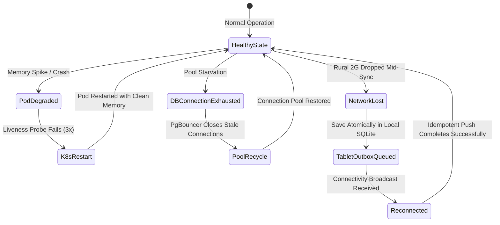

# 42 — SITE RELIABILITY ENGINEERING (SRE) & SELF-HEALING ARCHITECTURE

> **Document ID:** `BS-ARCH-42-SRE-PRACTICES`  
> **Classification:** Enterprise System Architecture Control Document  
> **SIH Problem ID:** SIH26042 | **Domain:** Mother-Tongue-Based Multilingual Education (MTB-MLE)  
> **Standard:** Google SRE Principles & Automated Self-Healing Systems (§32 Master Standard)  
> **Document Version:** 3.0.0-PROD | **Status:** Approved Baseline  

---

## 1. SRE Core Principles & Error Budget Policy

```text
┌─────────────────────────────────────────────────────────────────────────────┐
│                          SRE OPERATIONAL INVARIANTS                         │
├────────────────────┬────────────────────────────────────────────────────────┤
│ 1. Error Budget    │ If the 30-day service error budget is exhausted (>0.1% │
│    as Gatekeeper   │ downtime), non-critical feature deployments are frozen │
│                    │ until reliability is restored.                         │
├────────────────────┼────────────────────────────────────────────────────────┤
│ 2. Automated Toil  │ Operational tasks taking > 30 minutes/week (e.g., db   │
│    Elimination     │ cleanup, SSL renewal, offline pack builds) must be     │
│                    │ automated via Kubernetes CronJobs or BullMQ workers.   │
├────────────────────┼────────────────────────────────────────────────────────┤
│ 3. Blameless Culture│ All system outages require a blameless postmortem     │
│                    │ identifying systemic architectural vulnerabilities.    │
└────────────────────┴────────────────────────────────────────────────────────┘
```

---

## 2. Automated Self-Healing State Diagram



---

## 3. Alert Severity & Incident Escalation Matrix

| Severity Tier | Trigger Scenario | Paging Channel | Target MTTA (Ack) | Target MTTR (Resolve) |
|---|---|---|---|---|
| **P0: Critical** | Gateway 5xx $> 2\%$, Database down, Voice latency $> 5000\text{ ms}$. | PagerDuty / Phone Call to On-Call SRE | $\le 5\text{ minutes}$ | $\le 30\text{ minutes}$ |
| **P1: High** | Sync failure rate $> 5\%$, Redis memory $> 90\%$, COMET score $< 0.80$. | Slack `#alerts-urgent` + SMS | $\le 15\text{ minutes}$ | $\le 2\text{ hours}$ |
| **P2: Medium** | Cache hit ratio $< 60\%$, Disk storage $> 80\%$, Slow API queries. | Slack `#ops-monitoring` | $\le 1\text{ hour}$ | $\le 8\text{ hours}$ |
| **P3: Low** | Cosmetic UI warning, minor background telemetry delay. | Jira / GitHub Issue | Next Business Day | 1 Sprint |
