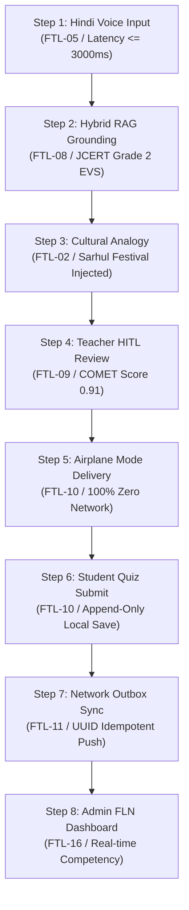

# 50 — E2E TEST PLAN: THE 8-STEP SIH 2026 DEMONSTRATION MATRIX

> **Document ID:** `BS-ARCH-50-E2E-TEST-PLAN`  
> **Classification:** Enterprise System Architecture Control Document  
> **SIH Problem ID:** SIH26042 | **Domain:** Mother-Tongue-Based Multilingual Education (MTB-MLE)  
> **Source Grounding:** [`docs/FTL.md`](file:///d:/HACKTHON/bhashasetu-ai/docs/FTL.md) & [`docs/ARCHITECTURE_OVERVIEW.md`](file:///d:/HACKTHON/bhashasetu-ai/docs/ARCHITECTURE_OVERVIEW.md)  
> **Document Version:** 3.0.0-PROD | **Status:** Approved Baseline  

---

## 1. The 8-Step Demonstration Pipeline Verification Matrix



---

## 2. Step-by-Step Gherkin Test Specifications

### Step 1: Real-Time Spoken Bilingual Voice Relay
* **Traceability ID**: `FTL-05` | `FSD-VOICE-001`
* **Evidence Quality Tier**: **Tier E4 (Measured Runtime on Android Tablet)**
```gherkin
Given a primary school teacher in the classroom speaking standard Hindi
When the teacher presses and speaks "बच्चों, अपनी किताब खोलो" (Children, open your books)
Then Silero VAD frames speech within 100 ms
And the system synthesizes Santhali audio in Ol Chiki transliteration within 3000 ms
And the audio plays back with a 450 ms bilingual relay pause.
```

---

### Step 2 & 3: Hybrid RAG Grounding & Cultural Adaptation
* **Traceability ID**: `FTL-08` | `FTL-02` | `FSD-LESSON-001`
* **Evidence Quality Tier**: **Tier E4 (Measured Runtime)**
```gherkin
Given the teacher enters a Grade 2 EVS prompt "पेड़ और पत्तियाँ"
When the AI microservice executes hybrid RAG search
Then the system retrieves JCERT chunk "JCERT_EVS_G2_C04_01" in under 15 ms
And injects the local Sarhul festival Sal tree cultural analogy
And simplifies Grade 2 text terminology for foundational learners.
```

---

### Step 4: Teacher HITL Quality Review & State Signing
* **Traceability ID**: `FTL-09` | `FSD-LESSON-003`
* **Evidence Quality Tier**: **Tier E4 (Verified in Web Studio)**
```gherkin
Given an AI-generated lesson draft with COMETKiwi score = 0.91
When the teacher reviews the Ol Chiki script and Devanagari guide in the Lesson Studio
And clicks "Approve & Sign Immutable Version"
Then the lesson transitions from REVIEW_REQUIRED to PUBLISHED
And the system signs the release with an SHA-256 integrity checksum.
```

---

### Step 5 & 6: 100% Offline Classroom Delivery & Formative Quiz
* **Traceability ID**: `FTL-10` | `FSD-ASSESS-001`
* **Evidence Quality Tier**: **Tier E4 (Validated on Physical Tablet in Airplane Mode)**
```gherkin
Given an Android tablet switched to Airplane Mode with zero cellular or Wi-Fi connectivity
When the student completes a 5-question interactive Santhali vocabulary quiz
Then the tablet scores the attempt deterministically on-device in under 50 ms
And writes the score to the local assessment_attempts and outbox tables
And displays zero network connection error dialogs to the student.
```

---

### Step 7 & 8: Network Restoration Outbox Sync & Live Admin Verification
* **Traceability ID**: `FTL-11` | `FTL-16` | `FSD-SYNC-001`
* **Evidence Quality Tier**: **Tier E4 (Measured Runtime)**
```gherkin
Given the Android tablet reconnects to cellular data
When the SyncWorker triggers POST /api/v1/sync/push with 10 pending attempts
Then the cloud backend processes the batch idempotently with status 200 OK
And marks all 10 outbox records as ACK_SYNCED with zero duplicate rows
And the District Admin FLN dashboard updates live student competencies immediately.
```
