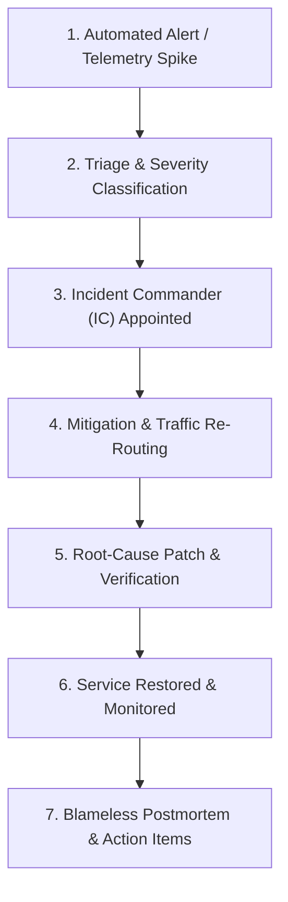

# 53 — INCIDENT MANAGEMENT & BLAMELESS POSTMORTEM PROTOCOL

> **Document ID:** `BS-ARCH-53-INCIDENT-RESP`  
> **Classification:** Enterprise System Architecture Control Document  
> **SIH Problem ID:** SIH26042 | **Domain:** Mother-Tongue-Based Multilingual Education (MTB-MLE)  
> **Standard:** PagerDuty Incident Commander & Google SRE Postmortem Framework  
> **Document Version:** 3.0.0-PROD | **Status:** Approved Baseline  

---

## 1. Incident Lifecycle & Operational Flow



---

## 2. Severity Classification Matrix

| Severity Level | Quantitative Criteria | Response SLA | Paging Channel | Incident Lead |
|---|---|---|---|---|
| **SEV-0: Catastrophic** | Primary database down, data corruption detected, total cloud outage. | **$\le 5\text{ mins}$** | Automated phone call to all engineers | Principal Architect / Lead |
| **SEV-1: Critical** | Live voice relay down, sync push failing for $> 20\%$ of schools. | **$\le 15\text{ mins}$** | PagerDuty high-urgency alert | Staff Backend / SRE |
| **SEV-2: Major** | RAG retrieval latency $> 100\text{ ms}$, COMET quality score drops. | **$\le 45\text{ mins}$** | Slack `#incidents-sev2` | AI Systems Engineer |
| **SEV-3: Minor** | Isolated web studio styling bug, non-blocking telemetry delay. | **$\le 4\text{ hours}$** | Slack `#ops-monitoring` | On-Duty Developer |

---

## 3. Formal Blameless Postmortem Template

```markdown
# INCIDENT POSTMORTEM: [INCIDENT-TITLE]
* **Date & Time (IST)**: YYYY-MM-DD HH:MM
* **Severity**: SEV-0 / SEV-1
* **Incident Commander**: [Name]
* **Total Downtime**: XX Minutes
* **Customer / Classroom Impact**: XX Schools Affected

## 1. Executive Summary
Brief non-technical summary of what happened, user impact, and resolution.

## 2. Root Cause Analysis (The 5 Whys)
1. Why did the service fail? -> Pod crashed due to OOM kill.
2. Why did it OOM? -> Memory exceeded 2GB limit.
3. Why did memory spike? -> Uncached vector query loaded full index into RAM.
4. Why was the query uncached? -> Redis eviction purged query keys during burst.
5. Why was Redis evicted? -> Maxmemory configuration set too low for peak sync.

## 3. Timeline of Events (All times in IST)
- 14:15: Prometheus alert triggers for API latency.
- 14:18: SRE acknowledged page; declared SEV-1.
- 14:24: SRE rolled back backend deployment to v3.0.0.
- 14:32: Latency returned to baseline 1855ms; incident resolved.

## 4. Corrective & Preventative Action Items
| Action Item | Type | Owner | Tracking Ticket |
|---|---|---|---|
| Increase Redis maxmemory to 1GB | Preventative | DevOps | JIRA-OPS-412 |
| Add memory circuit breaker to RAG engine | Architectural | AI Lead | JIRA-AI-881 |
```
