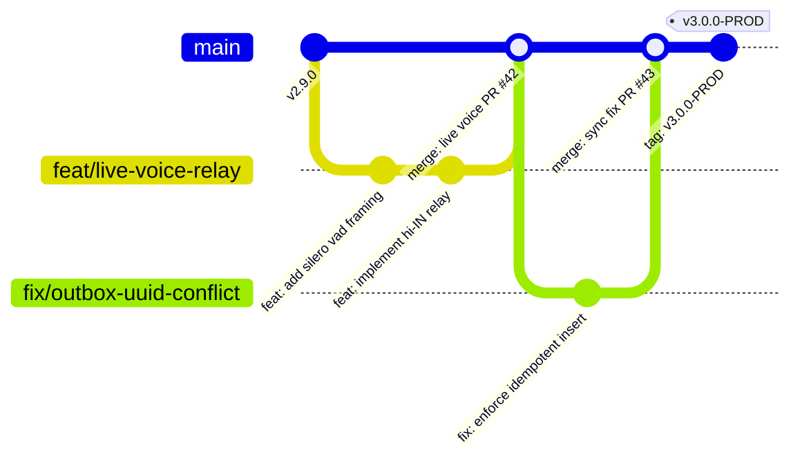

# 59 — GIT WORKFLOW, BRANCHING STRATEGY & CONVENTIONAL COMMITS

> **Document ID:** `BS-ARCH-59-GIT-WORKFLOW`  
> **Classification:** Enterprise System Architecture Control Document  
> **SIH Problem ID:** SIH26042 | **Domain:** Mother-Tongue-Based Multilingual Education (MTB-MLE)  
> **Standard:** GitHub Flow & Conventional Commits 1.0.0 (§75 Master Standard)  
> **Document Version:** 3.0.0-PROD | **Status:** Approved Baseline  

---

## 1. Branching Strategy: GitHub Flow

The monorepo enforces **GitHub Flow** with a protected `main` trunk:

---

## 2. Conventional Commits 1.0.0 Specification

Every commit header must adhere to the format:
$$\text{<type>}(\text{<optional scope>}): \text{<concise description>}$$

### Allowed Commit Types:
* `feat`: A new user-facing capability (e.g., `feat(voice): implement bilingual relay with 450ms pause`).
* `fix`: A bug patch in code or logic (e.g., `fix(sync): prevent duplicate outbox operation insertion`).
* `docs`: Documentation updates (e.g., `docs(arch): add C4 container diagram`).
* `perf`: A code change that improves performance (e.g., `perf(rag): switch vector index to DiskANN`).
* `refactor`: Code change that neither fixes a bug nor adds a feature (e.g., `refactor(tts): hoist audio state to viewModel`).
* `test`: Adding or correcting automated tests (e.g., `test(android): add defensive LayoutLib runner`).
* `chore`: Build system or dependency updates (e.g., `chore(gradle): limit workers to 2`).

---

## 3. Pull Request Merge Strategy

1. **Squash and Merge**: Pull requests are merged using **Squash and Merge** by default to maintain a clean, linear Git history on `main`.
2. **Protected Trunk**: Direct pushes to `main` are cryptographically blocked by GitHub branch protection rules; all changes must pass automated CI checks.
