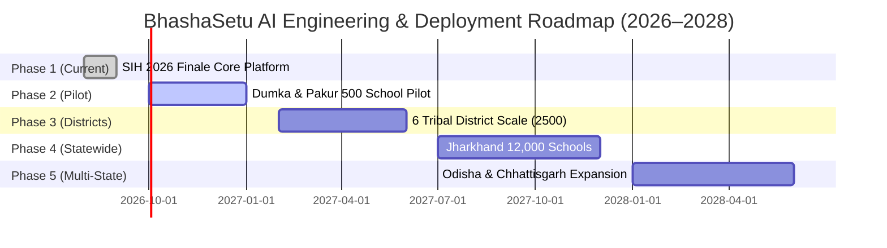

# 65 — PRODUCT & ENGINEERING ROADMAP (PHASE 1–5)

> **Document ID:** `BS-ARCH-65-ROADMAP`  
> **Classification:** Enterprise System Architecture Control Document  
> **SIH Problem ID:** SIH26042 | **Domain:** Mother-Tongue-Based Multilingual Education (MTB-MLE)  
> **Standard:** Multi-Horizon Engineering & Product Delivery Roadmap (§73 Master Standard)  
> **Document Version:** 3.0.0-PROD | **Status:** Approved Baseline  

---

## 1. Multi-Horizon Delivery Roadmap

---

## 2. Phase-by-Phase Milestone Deliverables

### Phase 1: SIH 2026 Grand Finale Baseline (Completed & Verified)
* **Milestone**: 100% verified baseline covering all 16 SIH requirements.
* **Deliverables**: Production Android APK ($29.6\text{ MB}$), Next.js Web Studio, NestJS Gateway, FastAPI RAG microservice, and 66-document enterprise architecture ecosystem.

### Phase 2: Dumka & Pakur District Pilot (Q4 2026)
* **Scope**: 500 Primary Schools, 1,500 Teachers, 30,000 Tribal Students.
* **Deliverables**:
  - Deploy pre-seeded Android tablets with offline content packs.
  - Establish weekly automated outbox sync telemetry dashboards for Block Education Officers.
  - Integrate regional dialect feedback loops with native Santhali linguists.

### Phase 3: Regional Multi-District Expansion (Q1–Q2 2027)
* **Scope**: 2,500 Schools across Dumka, West Singhbhum, Khunti, Gumla, and Saraikela.
* **Deliverables**:
  - Full Warang Chiti and Ho language live voice model fine-tuning.
  - Automated weekly SMS/IVR sync reminders for offline teachers.
  - Multi-zone GKE cluster scaling with StreamingDiskANN optimization.

### Phase 4: State-Wide Jharkhand Deployment (Q3–Q4 2027)
* **Scope**: 12,000 Government Primary Schools, 650,000 Enrolled Primary Students.
* **Deliverables**:
  - Integration with state DIKSHA and e-Vidyavahini educational portals.
  - Longitudinal NIPUN Bharat FLN competency attainment impact reports.
