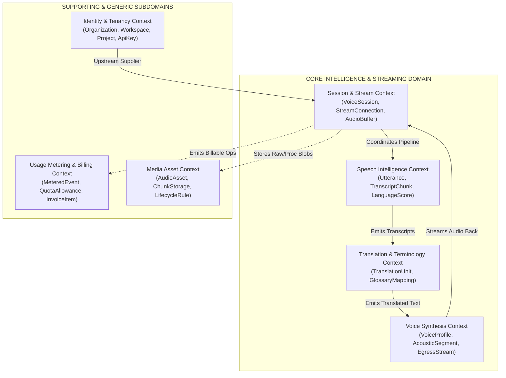
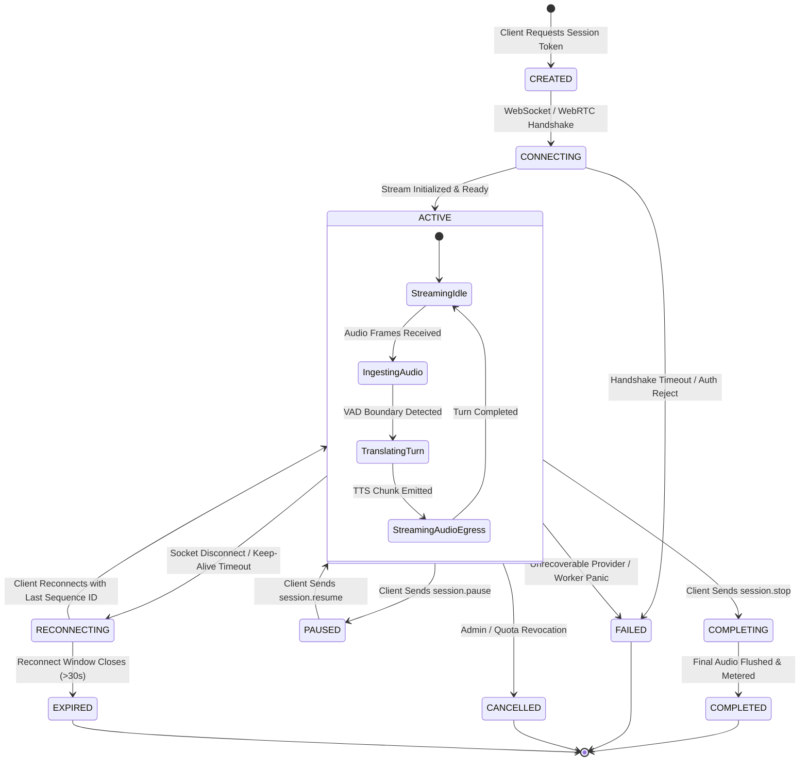

# 04 — DOMAIN-DRIVEN DESIGN (DDD) MODEL & STATE MACHINES

> **Document ID:** `VOX-ARCH-04-DOMAIN-MODEL`  
> **Platform Name:** VoxBridge AI (Enterprise Multilingual Voice Translation API Platform)  
> **Classification:** Production-Grade Systems Architecture Document  
> **Standard:** Strategic & Tactical Domain-Driven Design (DDD)  
> **Document Version:** 4.0.0-PROD | **Status:** Active Master Reference  

---

## 1. Strategic Bounded Context Map

VoxBridge AI partitions its business domain into seven bounded contexts with formal relationship mappings:

---

## 2. Core Aggregates, Entities & Value Objects

### 2.1 VoiceSession (Aggregate Root in Session Context)
* **Aggregate Root**: `VoiceSession`
  * **Entities**: `StreamConnection`, `SessionParticipant`, `ActiveRouter`
  * **Value Objects**:
    - `SessionId` (ULID prefixed `ses_`)
    - `TenantId` (`org_... / prj_...`)
    - `AudioFormat` (Codec, SampleRate, Channels, BitDepth)
    - `LanguagePair` (SourceLanguage, TargetLanguageList)
    - `LatencyClass` (`ULTRA_LOW_LATENCY`, `BALANCED`, `HIGH_QUALITY`)
  * **Invariants**:
    1. A `VoiceSession` cannot transition to `ACTIVE` without a verified `ApiKey` possessing the `session.create` permission.
    2. A `VoiceSession` enforces a hard ceiling on duration ($120\text{ minutes}$ standard, $480\text{ minutes}$ enterprise).
    3. All events within a session possess a monotonically increasing 64-bit integer `sequence_number`.

### 2.2 Utterance (Aggregate Root in Speech Context)
* **Aggregate Root**: `Utterance`
  * **Entities**: `AudioSegment`, `TranscriptChunk`
  * **Value Objects**:
    - `UtteranceId` (`utt_...`)
    - `TimeSpan` (StartMs, EndMs, DurationMs)
    - `TranscriptStatus` (`PARTIAL`, `FINAL`, `CORRECTED`)
    - `ConfidenceScore` (Float $0.0 - 1.0$)
    - `DetectedLanguage` (ISO-639 code + probability)
  * **Invariants**:
    1. `PARTIAL` transcripts are ephemeral and may be overwritten by subsequent speech frames.
    2. A `FINAL` transcript is immutable once emitted; subsequent modifications must spawn a `CORRECTED` revision with a reference to the parent segment ID.

---

## 3. Deterministic Session Lifecycle State Machine

Streaming sessions must transition deterministically through validated states:

