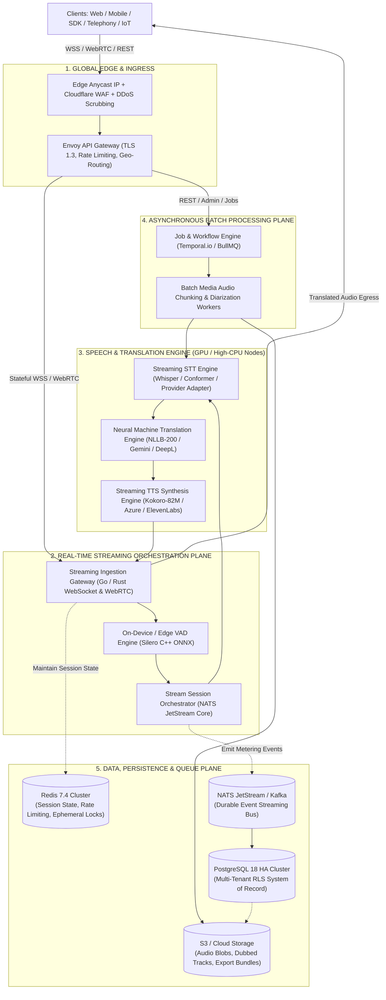

# 05 — HIGH-LEVEL SYSTEM ARCHITECTURE & PIPELINE DESIGNS

> **Document ID:** `VOX-ARCH-05-SYSTEM-ARCH`  
> **Platform Name:** VoxBridge AI (Enterprise Multilingual Voice Translation API Platform)  
> **Classification:** Production-Grade Systems Architecture Document  
> **Pattern:** Event-Driven Modular Microservices with Specialized Streaming Gateways  
> **Document Version:** 4.0.0-PROD | **Status:** Active Master Reference  

---

## 1. Global System Architecture Blueprint



---

## 2. Pipeline Decomposition & Execution Semantics

### 2.1 Pipeline A — Batch Audio Pipeline (Asynchronous, High Throughput)
$$\text{Audio Upload} \to \text{Validation} \to \text{S3 Stash} \to \text{Temporal Workflow} \to \text{Diarized STT} \to \text{Glossary MT} \to \text{TTS Dub} \to \text{Webhook}$$
* **Throughput**: Optimized for high file volume rather than sub-second latency.
* **Failure Model**: If a single 5-minute chunk fails translation, only that chunk is retried with backoff; the workflow does not restart from zero.

### 2.2 Pipeline B — Streaming Pipeline (Ultra-Low Latency, Stateful)
$$\text{Frame Ingest} \to \text{Jitter Buffer} \to \text{Silero VAD} \to \text{Partial STT} \to \text{Speculative MT} \to \text{First-Byte TTS} \to \text{Egress}$$
* **Concurrency Model**: Stateful actor-based connection loop per active session; zero disk writes in the critical audio forwarding loop.
* **Latency Guarantee**: P95 Time-to-First-Audio $\le 1200\text{ ms}$.

### 2.3 Pipeline C — Conversational Two-Way Interpretation
* **Speaker Isolation**: Tracks multiple participants in a single virtual room.
* **Ducking & Arbitration**: When Speaker A is translating, incoming audio from Speaker B is held in an acoustic queue to prevent speech collisions.

---

## 3. Architecture Topology Evaluation

```text
┌─────────────────────────────────────────────────────────────────────────────┐
│                    TOPOLOGY EVALUATION & SELECTION                          │
├───────────────────┬──────────────────────┬──────────────────────────────────┤
│ Evaluated Pattern │ Pros / Cons          │ Strategic Decision               │
├───────────────────┼──────────────────────┼──────────────────────────────────┤
│ Option 1: Monolith│ • Simple operational │ REJECTED: Long-running streaming │
│                   │   deployment         │ WebSockets starve under batch    │
│                   │ • High blast radius  │ media CPU spikes; impossible to  │
│                   │ • Hard to autoscale  │ scale GPU workers independently. │
├───────────────────┼──────────────────────┼──────────────────────────────────┤
│ Option 2: 30-Pcs  │ • Complete decoupling│ REJECTED: Severe network hop     │
│ Microservices     │ • Massive latency    │ tax adds 150-250ms inter-service │
│                   │ • High ops overhead  │ latency; catastrophic for voice. │
├───────────────────┼──────────────────────┼──────────────────────────────────┤
│ Option 3: Hybrid  │ • Decoupled streaming│ SELECTED: Consolidates non-real- │
│ Streaming + Core  │   gateways (Go/Rust) │ time services into modular       │
│ (Chosen Model)    │ • Co-located tensor  │ domain cores; dedicates raw      │
│                   │   inference pipelines│ high-performance runtime to voice│
└───────────────────┴──────────────────────┴──────────────────────────────────┘
```
