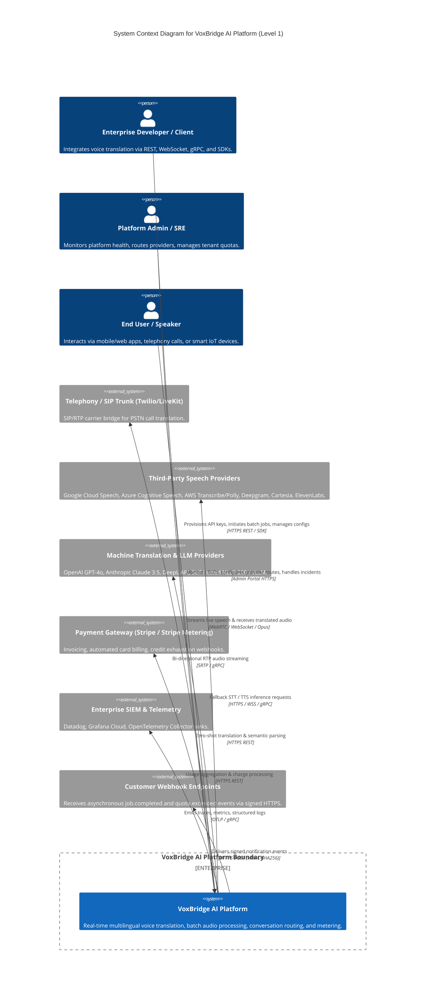

# VoxBridge AI — C4 Architecture: Level 1 System Context

## 1. System Context Diagram (Mermaid Diagram 1)

The System Context diagram provides a 30,000-foot view of VoxBridge AI, illustrating its interaction boundaries with human actors (end-users, enterprise developers, platform operators) and external external downstream systems (telephony networks, cloud providers, third-party speech engines, payment processors, and customer webhooks).

---

## 2. Actor and Boundary Specifications

### 2.1 Primary Actors

| Actor | Protocol Interfaces | Authentication Mechanism | Operational SLA Target | Data Classification Access |
|---|---|---|---|---|
| **Enterprise Developer** | HTTPS `/v1/*`, CLI, SDKs | HMAC Secret API Keys (`vox_live_*`, `vox_test_*`), OAuth2 MTLS | 99.95% API Availability | Project-scoped metadata, transcripts, billing configurations |
| **End User / Speaker** | WebRTC Data/Media, WSS `/v1/realtime` | Short-lived Session Tokens (`vxt_sess_*`, 15-minute expiry) | 99.9% Stream Connection Availability | Transient audio streams, decrypted live captions |
| **Platform SRE / Admin** | Web UI, Admin API `/v1/admin/*` | Okta / Google Workspace SSO + FIDO2 WebAuthn MFA | 99.99% Admin Gateway Availability | Platform-wide operational telemetry, tenant audit logs |

### 2.2 External System Dependencies & Trust Boundaries

1. **Telephony & Media Carrier Bridges (Twilio, LiveKit Cloud, Telnyx)**
   - *Interface:* SIP/SRTP and gRPC Media Streams over TLS.
   - *Trust Boundary:* Untrusted perimeter. Ingestion proxies enforce strict G.711 / Opus payload validation, packet jitter buffering, and IP ACLs before audio reaches processing pipelines.
2. **Third-Party Model Providers (Google Cloud Speech, Azure, AWS, Deepgram, OpenAI, DeepL)**
   - *Interface:* HTTPS REST / gRPC with mTLS or scoped IAM tokens.
   - *Trust Boundary:* External compute. Data processing agreements (DPAs) enforce zero-retention (`zero_data_retention=true`). Payload encryption in transit via TLS 1.3 with PFS (Perfect Forward Secrecy).
3. **Payment & Metering Subsystems (Stripe / Lago)**
   - *Interface:* HTTPS REST with idempotency keys (`Idempotency-Key: {uuidv7}`).
   - *Trust Boundary:* PCI-DSS compliant boundary. VoxBridge stores zero credit card data, transmitting only aggregated usage counters and tenant customer references.
4. **Client Webhook Destinations**
   - *Interface:* Outbound HTTPS POST requests.
   - *Trust Boundary:* Untrusted foreign network. Handled by an asynchronous, isolated egress proxy with strict DNS rebinding protections (RFC 1918 private IP blocking) and HMAC-SHA256 request signing.

---

## 3. Boundary Invariants & Guarantees

- **No Inbound Cleartext Traffic:** All network perimeter ingestion points immediately terminate TLS 1.3 or discard connections. HSTS (`max-age=63072000; includeSubDomains; preload`) is strictly enforced at Cloudflare Edge.
- **Strict Tenant Boundary Enforcement:** Every external request is cryptographically bound to an `OrganizationID`, `WorkspaceID`, and `ProjectID` prior to passing the API Gateway layer.
- **Provider Transparency vs. Decoupling:** Downstream clients integrate strictly with standardized VoxBridge contracts. Provider-specific anomalies, schema updates, or rate limits are shielded by the Provider Gateway abstraction layer.
