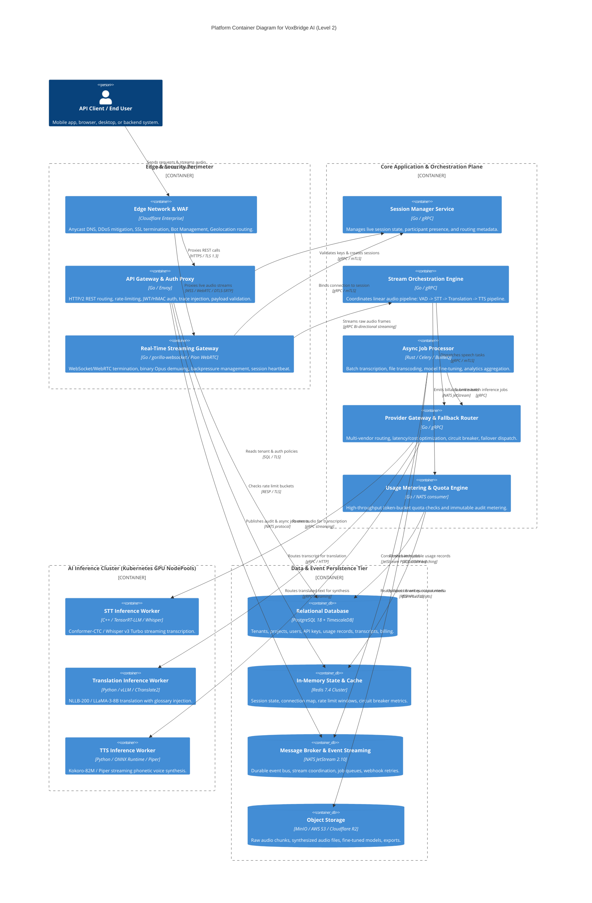

# VoxBridge AI — C4 Architecture: Level 2 Platform Container

## 1. Platform Container Diagram (Mermaid Diagram 2)

The Container diagram decomposes the VoxBridge AI Platform into deployable runtime execution units (services, data stores, message buses, and edge proxies), identifying the communication protocols and persistent stores utilized across the ecosystem.

---

## 2. Container Inventory & Specifications

| Container Name | Runtime / Base Image | Ports & Protocols | Concurrency Model | High Availability & Scaling Profile | Primary Persistence Target |
|---|---|---|---|---|---|
| **API Gateway** | Go 1.23 / Scratch base | 443 (HTTPS), 8080 (Internal gRPC) | Goroutines (epoll-driven), 15k RPS/instance | HPA based on HTTP request rate (Target: 70% CPU, min 3, max 30 pods) | Redis (Rate limits) / PostgreSQL |
| **Real-Time Streaming Gateway** | Go 1.23 / Alpine 3.20 | 8443 (WSS), 10000-20000 (WebRTC UDP) | Non-blocking ring buffers, 5k concurrent sessions/pod | HPA based on Active Connection Count (min 4, max 50 pods across multi-AZ) | Redis (Connection-to-node routing table) |
| **Stream Orchestrator** | Go 1.23 / Alpine 3.20 | 9090 (gRPC) | Channel-based pipeline actor per session | HPA based on Active Stream Count (Target: 500 sessions/pod) | Redis (Transient context) / NATS |
| **STT Inference Worker** | C++ / NVIDIA CUDA 12.4 base | 50051 (gRPC) | GPU TensorRT batching (batch size 16 dynamic) | Custom Metrics HPA: GPU Compute % / Queue Depth (min 2, max 100 GPU pods) | Memory (VRAM) / Shared NVMe cache |
| **Translation Worker** | Python 3.12 / vLLM runtime | 50052 (gRPC / HTTP) | Continuous dynamic batching, PagedAttention | HPA based on GPU memory & token queue latency | VRAM / Local HuggingFace cache |
| **TTS Inference Worker** | Python 3.12 / ONNX Runtime | 50053 (gRPC) | Multi-worker ONNX inference engine (CPU/GPU) | HPA based on Synthesis Request Backlog | VRAM / S3 (Voice embeddings cache) |
| **Async Job Processor** | Rust 1.81 / Debian Slim | None (Worker daemon) | Tokio async threadpool (32 workers/node) | KEDA Scaler on NATS JetStream Consumer Lag | S3 / PostgreSQL |
| **Usage Metering Engine** | Go 1.23 / Scratch | 9095 (Internal metrics) | Batch buffered NATS consumers (5000 items/flush) | Fixed 3-node HA replica set | PostgreSQL `usage_records` / TimescaleDB |

---

## 3. Communication Protocols and Inter-Container Standards

### 3.1 Synchronous Communication
- **gRPC over HTTP/2 with mTLS:** All internal RPC boundaries (e.g., Gateway to Session Manager, Orchestrator to Inference Workers) enforce mutual TLS using internal SPIFFE/SPIRE x509 workload certificates.
- **Strict Frame Serialization:** Binary streaming uses Google Protocol Buffers v3 with zero-copy buffer slicing to eliminate CPU memory copying during audio packet transfer.

### 3.2 Asynchronous Event Streaming
- **NATS JetStream 2.10:** Replaces heavy Kafka overhead while offering sub-millisecond pub/sub latency, distributed deduplication, consumer acknowledgement tracking, and durable stream persistence (`FileStorage`).
- **Subject Taxonomy:** Partitioned by tenant tier and event domain:
  - `voxbridge.events.session.>` — Live lifecycle transitions.
  - `voxbridge.metering.usage.>` — High-throughput billing ticks.
  - `voxbridge.jobs.batch.>` — Heavyweight asynchronous pipeline tasks.

---

## 4. Container Invariants & Anti-Patterns Rejected

1. **No Direct Inference Worker Exposure:** Model workers (Whisper, NLLB, Piper) are strictly isolated within a non-routable private VPC subnet (`10.100.0.0/16`). They never accept public ingress traffic.
2. **Stateless Gateway Tier:** Neither the API Gateway nor the Streaming Gateway stores canonical session state on local disk. If a streaming gateway pod crashes, the client reconnects with an idempotent resume token to any available gateway instance.
3. **Dedicated Ingestion vs. Heavy Inference:** Transcoding and speech inference are separated. Heavy GPU instances are never starved by slow client network connections.
