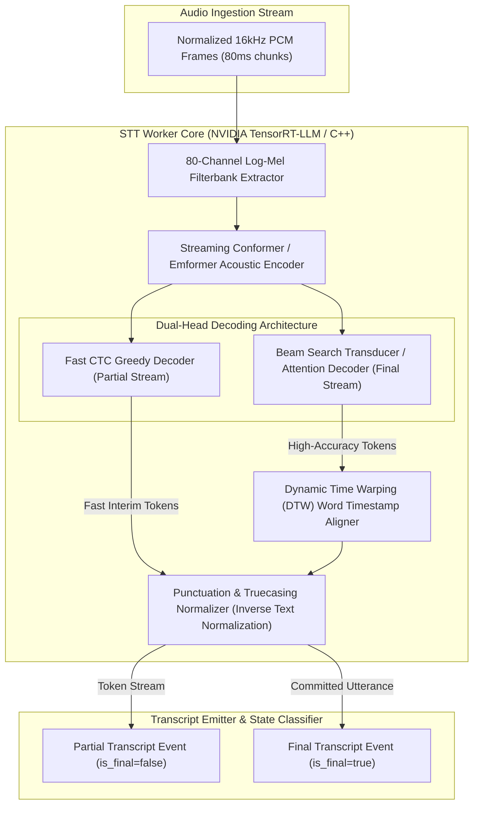

# VoxBridge AI — Speech Recognition (STT) Architecture

## 1. Speech Recognition Pipeline Topology (Mermaid Diagram 5)

The STT Pipeline architecture illustrates the step-by-step conversion of normalized 16kHz audio frames into partial and final linguistic transcripts, featuring dual-path decoding (streaming CTC for instant feedback and chunked transformer attention for final accuracy).



---

## 2. Model Selection: Streaming Conformer-CTC vs. Whisper v3 Turbo

| Metric / Dimension | Streaming Conformer-CTC (NeMo) | Whisper v3 Turbo (OpenAI / TensorRT) | VoxBridge Role |
|---|---|---|---|
| **Architecture** | Chunk-aware Conformer with left-context caching | Encoder-Decoder Transformer with Cross-Attention | **Conformer for Real-Time Streaming; Whisper for Batch Processing** |
| **Inference Mode** | Continuous frame-by-frame streaming ($80\text{ms}$ step) | Block-based chunking ($30\text{s}$ windows or $1\text{s}$ overlapping) | Dual-engine fallback routing |
| **Time to First Token (TTFT)** | $120\text{ms} - 180\text{ms}$ | $450\text{ms} - 800\text{ms}$ | Conformer meets $<250\text{ms}$ streaming target |
| **Word Error Rate (Clean Audio)** | $8.2\%$ (LibriSpeech test-clean) | $6.9\%$ (LibriSpeech test-clean) | Whisper provides higher accuracy on accents |
| **Hallucination Risk** | Near Zero (CTC alignment bounds tokens to acoustic energy) | Non-zero (Autoregressive decoder can loop on silence or music) | Conformer immune to silence looping |
| **Multilingual Breadth** | High on Top 25 languages; requires regional acoustic heads | Broad (99+ languages natively tokenized) | Whisper selected for rare language batch jobs |

---

## 3. Transcript State Lifecycle: Partial vs. Final vs. Corrected

```
[AUDIO CHUNK RECEIVED] 
       │
       ▼
 [PARTIAL STATE] (is_final: false)
  - Emitted every 160ms over WebSocket
  - Fast CTC greedy output
  - Transient display ONLY (Captions / Visualizer)
  - NEVER committed to permanent DB
  - NEVER sent to speech synthesis (Prevents audio stutter)
       │
       ▼ (Utterance Boundary / VAD Silence Trigger: 350ms)
 [FINAL STATE] (is_final: true)
  - Beam Search with 5-gram language model rescoring
  - Full punctuation & inverse text normalization applied
  - Exact word-level start/end millisecond timestamps
  - Committed to PostgreSQL & NATS
  - Dispatched to Translation Engine & TTS
       │
       ▼ (Post-Processing / Secondary Pass in Batch Mode)
 [CORRECTED STATE] (is_final: true, is_corrected: true)
  - Full audio file context re-evaluated
  - Speaker diarization labels attached
  - Replaces previous transcript record in storage
```

---

## 4. Word-Level Metadata & Confidence Scoring

Final transcripts generate rich JSON payloads containing millisecond-level word alignments:

```json
{
  "utterance_id": "utt_01J8W4E5F6",
  "is_final": true,
  "language": "en-US",
  "confidence": 0.965,
  "text": "The total balance is $45.20.",
  "words": [
    {"word": "The", "start_time_ms": 120, "end_time_ms": 240, "confidence": 0.98},
    {"word": "total", "start_time_ms": 260, "end_time_ms": 580, "confidence": 0.97},
    {"word": "balance", "start_time_ms": 600, "end_time_ms": 940, "confidence": 0.99},
    {"word": "is", "start_time_ms": 960, "end_time_ms": 1080, "confidence": 0.95},
    {"word": "$45.20", "start_time_ms": 1100, "end_time_ms": 1640, "confidence": 0.94}
  ]
}
```

### 4.1 Inverse Text Normalization (ITN)
Acoustic tokens ("forty five dollars and twenty cents") are deterministically converted into standardized visual representations ("$45.20") using WFST (Weighted Finite-State Transducers) based on NeMo ITN grammar rules. This prevents translation engines from confusing written currency symbols with spoken phrases.
