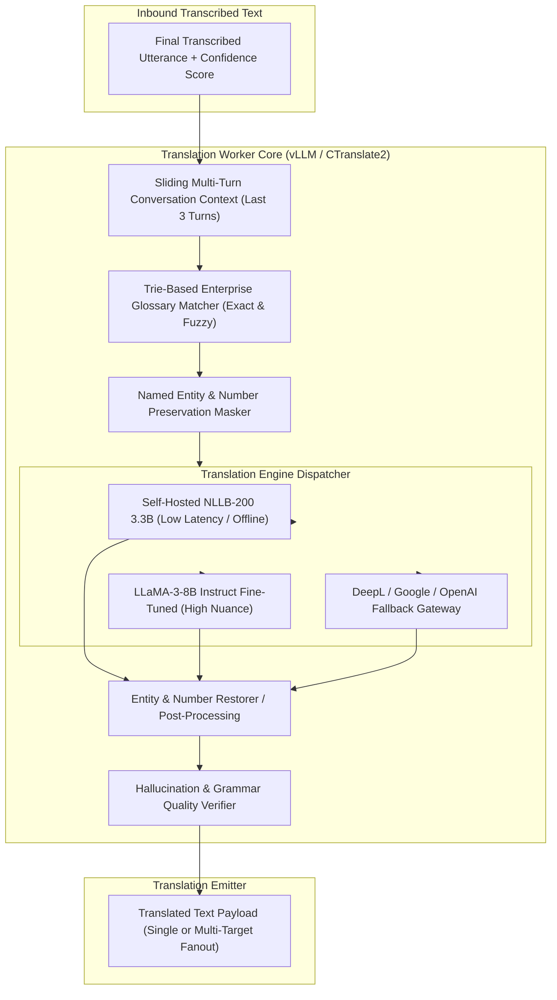

# VoxBridge AI — Neural Machine Translation (NMT) Architecture

## 1. Machine Translation Pipeline Topology (Mermaid Diagram 6)

The Machine Translation pipeline transforms transcribed text into culturally fluent, grammatically accurate translations while injecting tenant-specific glossaries and preserving named entities, numbers, and technical terminology.



---

## 2. Multi-Target Language Fan-Out Architecture

In Mode E (Speech $\to$ Multiple Target Languages) and Mode H (Multi-Party Meetings), a single spoken utterance must be translated simultaneously into multiple target languages (e.g., English speaker translated to Spanish, Hindi, French, and Japanese):

```
                       ┌─────────────────────────┐
                       │  Input Utterance (en)   │
                       └────────────┬────────────┘
                                    │
                  ┌─────────────────┼─────────────────┐
                  ▼                 ▼                 ▼
           [Worker: es-ES]   [Worker: hi-IN]   [Worker: ja-JP]
                  │                 │                 │
                  ▼                 ▼                 ▼
          "Hola, buenos días" "नमस्ते, शुभ प्रभात" "おはようございます"
                  │                 │                 │
                  └─────────────────┼─────────────────┘
                                    ▼
                     [Aggregated Multi-Event Fanout]
```

- **Parallelism:** Translations run concurrently across GPU workers. The slowest target language does not block faster targets from streaming their audio chunks to connected listeners.
- **Shared Ingestion:** Audio decode and STT transcription execute once, preventing redundant compute overhead.

---

## 3. Enterprise Glossary & Terminology Matching

### 3.1 Radix Trie Exact Match Injection
Enterprise clients supply domain dictionaries (medical terminology, product brand names, proprietary acronyms) via `/v1/glossaries`. 
- Matching is executed in sub-millisecond time via an in-memory **Aho-Corasick Radix Trie**.
- Matched tokens are injected into the translation prompt using XML constraint delimiters:
  ```
  Source: "Please update the VoxBridge Gateway firmware."
  Glossary Constraint: <glossary src="VoxBridge Gateway" tgt="भाषासेतु गेटवे" />
  Prompt Sent to NMT:
  <translate src="en" tgt="hi">
    Please update the <term tgt="भाषासेतु गेटवे">VoxBridge Gateway</term> firmware.
  </translate>
  ```

---

## 4. Preservation Invariants

| Element Type | Example Source | Untrained Translation Risk | VoxBridge Mitigation Strategy |
|---|---|---|---|
| **Named Entities** | "Ravi Singh joined Anthropic." | Translating "Singh" into "Lion" literally. | Spacy NER masking: Replaced with token `__ENT_PER_0__` during inference and restored post-decoding. |
| **Phone / Account Numbers**| "Routing number 021000021." | Dropping leading zeros or translating into descriptive text. | Regex numerical boundary validation; strict regex equality check between source and target digits. |
| **Currency Values** | "Invoice amount is £1,450.00." | Converting symbols incorrectly or changing separators. | Currency preservation rules maintaining original symbol and numeric decimal separator standards. |
| **URLs & Code Identifiers**| "Visit https://api.voxbridge.ai"| Attempting to translate domain names or path slugs. | Strict URI regex pass-through; tokens flagged as non-translatable literal spans. |

---

## 5. Quality Metrics & Automated Evaluation

Every batch job and a sampled $1\%$ of live production sessions are automatically scored against reference models using:
1. **COMET (Crosslingual Optimized Metric for Evaluation of Translation):** Neural metric predicting human quality judgements (Target: $\text{COMET} \ge 0.82$).
2. **BLEU (Bilingual Evaluation Understudy):** N-gram precision overlap against gold standards (Target: $\text{BLEU} \ge 36.0$).
3. **Hallucination Detection:** If the target character length exceeds source character length by more than $250\%$ or repeats a single 3-word n-gram more than 3 times, the output is flagged as an autoregressive hallucination, discarded, and re-routed to the secondary fallback model.
