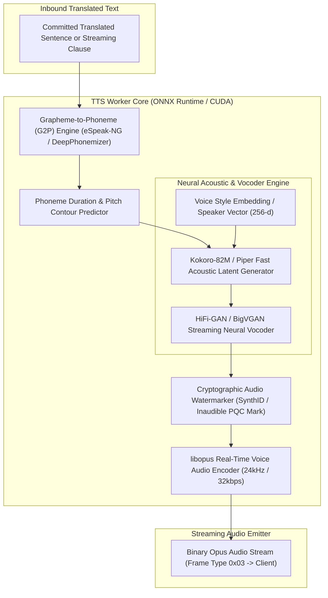

# VoxBridge AI — Speech Synthesis (TTS) Architecture

## 1. Speech Synthesis Pipeline Topology (Mermaid Diagram 7)

The Speech Synthesis pipeline converts translated target text into natural, emotionally expressive, low-latency audio streams, performing grapheme-to-phoneme conversion, acoustic latent generation, and neural vocoding before chunking into 20ms Opus frames.



---

## 2. Low-Latency Streaming Synthesis Engine

### 2.1 Model Topology: Kokoro-82M & Piper
VoxBridge deploys a dual-tier neural synthesis architecture:
- **Kokoro-82M:** An ultra-compact, high-fidelity 82-million parameter diffusion-transformer model delivering human-parity naturalness with an outstanding **Real-Time Factor (RTF) of 0.12** on NVIDIA A10G GPUs (synthesizing 10 seconds of speech in 1.2 seconds).
- **Piper (ONNX Runtime):** Deployed on CPU fallbacks and low-resource edge nodes, delivering an RTF of 0.18 on modern x86_64 AVX2 instances.

### 2.2 Clause-Based Progressive Streaming
Instead of waiting for an entire translated paragraph or sentence to complete, the TTS engine utilizes **syntactic clause boundary chunking**:
1. STT emits partial transcript: `"When we finalize the contract,"`
2. Translation outputs clause in Spanish: `"Cuando finalicemos el contrato,"`
3. TTS begins synthesizing immediately upon detecting the comma boundary, delivering the **First Audio Byte (TTFA) within 280ms** of the user speaking the clause.
4. Subsequent clauses are stitched seamlessly in the client jitter buffer with zero acoustic clicks or phase discontinuities.

---

## 3. Voice Control Parameters

Clients configure voice output characteristics via the session request or dynamically via `session.update`:

| Parameter | Type | Valid Range | Default | Description |
|---|---|---|---|---|
| `voice_id` | String | Standard Voice Catalog | `vox_voice_neural_mateo_es` | The target speaker profile and phonetic accent. |
| `speed` | Float | `0.5` to `2.0` | `1.0` | Speaking rate multiplier. Preserves pitch during adjustment. |
| `pitch` | Float | `-20.0` to `+20.0` | `0.0` | Semitone pitch adjustment contour. |
| `volume_gain_db` | Float | `-12.0` to `+6.0` | `0.0` | Dynamic range loudness leveling. |
| `emotion_preset`| Enum | `NEUTRAL`, `WARM`, `ASSERTIVE` | `NEUTRAL` | Subtle prosody variation for call center or enterprise contexts. |

---

## 4. Voice Preservation & Cloning Security Subsystem

Voice cloning introduces severe societal and enterprise security risks (voice deepfakes, CEO impersonation, biometric bypass). VoxBridge isolates voice replication into a strictly guarded subsystem.

```
                  [VOICE CLONING REQUEST]
                             │
                             ▼
     ┌─────────────────────────────────────────────────┐
     │ 1. Granular Permission Check                    │
     │    - Requires RBAC scope: `voice:clone:create`  │
     │    - Explicitly barred on basic/standard tiers  │
     └───────────────────────┬─────────────────────────┘
                             │
                             ▼
     ┌─────────────────────────────────────────────────┐
     │ 2. Cryptographic Voice Consent Verification     │
     │    - Speaker MUST read dynamic anti-spoof script│
     │      ("I, [Name], authorize VoxBridge on [Date]")│
     │    - Liveness detection verifies natural breath │
     └───────────────────────┬─────────────────────────┘
                             │
                             ▼
     ┌─────────────────────────────────────────────────┐
     │ 3. Synthetic Audio Watermarking                 │
     │    - All synthesized audio embeds inaudible     │
     │      cryptographic watermark containing:        │
     │      Tenant ID, Voice ID, and Timestamp         │
     └───────────────────────┬─────────────────────────┘
                             │
                             ▼
     ┌─────────────────────────────────────────────────┐
     │ 4. Immutable Audit Trail                        │
     │    - Every generated audio minute is recorded   │
     │      in an immutable compliance ledger          │
     └─────────────────────────────────────────────────┘
```

### 4.1 Permission Tiers
1. **Tier 1 (`voice.use`):** Access to pre-cleared standard neural voices.
2. **Tier 2 (`voice.personalize`):** Adjust speed, pitch, and timbre parameters on existing voices.
3. **Tier 3 (`voice.clone`):** Custom 3-second zero-shot speaker embedding replication. Requires signed DPA and identity verification.
