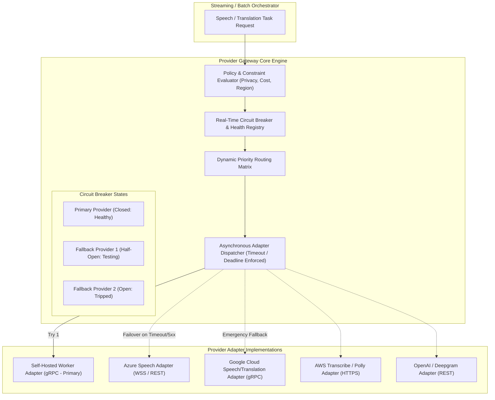

# VoxBridge AI — Provider Gateway & Multi-Vendor Abstraction

## 1. Provider Router Topology (Mermaid Diagram 8)

The Provider Gateway isolates internal platform services from external speech and translation vendor differences. It evaluates live health metrics, customer data residency constraints, latency budgets, and cost policies to select the optimal model adapter.



---

## 2. Universal Provider Abstraction Contract

Every speech or translation provider (whether self-hosted in Kubernetes or external cloud API) must implement the universal Go adapter interface:

```go
package provider

import (
    "context"
    "io"
    "time"
)

type SpeechTaskType string

const (
    TaskSTT         SpeechTaskType = "STT"
    TaskTranslation SpeechTaskType = "TRANSLATION"
    TaskTTS         SpeechTaskType = "TTS"
)

type ProviderCapabilities struct {
    SupportedLanguages []string
    SupportsStreaming  bool
    SupportsWordTimestamps bool
    MaxAudioDurationSec int
    AverageLatencyMs    int
    CostPerUnitUSD      float64
}

type ProviderAdapter interface {
    ProviderID() string
    TaskType() SpeechTaskType
    Capabilities() ProviderCapabilities
    
    // Real-Time Streaming Ingestion
    StreamSTT(ctx context.Context, audioIn io.Reader, resultsOut chan<- TranscriptEvent) error
    StreamTTS(ctx context.Context, textIn <-chan string, audioOut io.Writer) error
    
    // Synchronous Batch Operations
    Translate(ctx context.Context, req TranslationRequest) (*TranslationResponse, error)
    
    // Health & Circuit Breaking
    HealthCheck(ctx context.Context) (isHealthy bool, latency time.Duration, err error)
}
```

---

## 3. Circuit Breaker State Machine

Each `(ProviderID, TaskType, Region)` tuple is governed by an independent in-memory and Redis-synchronized circuit breaker:

```
                  ┌──────────────────────┐
                  │        CLOSED        │
                  │   (Normal Traffic)   │
                  └──────────┬───────────┘
                             │
     Error Rate > 15% OR Consec Failures >= 5
     OR p95 Latency > 2.5x Target for 30s
                             │
                             ▼
                  ┌──────────────────────┐
                  │         OPEN         │
                  │ (Fast Fail / Bypass) │
                  └──────────┬───────────┘
                             │
             Cooldown Period Elapsed (30 Seconds)
                             │
                             ▼
                  ┌──────────────────────┐
                  │      HALF-OPEN       │
                  │  (Canary Trial: 5%)  │
                  └──────────┬───────────┘
                             │
           ┌─────────────────┴─────────────────┐
           ▼ Success >= 95%                    ▼ Failure Occurs
    Return to CLOSED                     Return to OPEN (60s Cooldown)
```

---

## 4. Multi-Tier Fallback Rules & Compliance Guardrails

```
[TASK ARRIVES]
      │
      ▼
PRIMARY PROVIDER (Self-Hosted Kubernetes GPU NodePool)
      │
      ├─► Success ──► Return Audio / Transcript
      │
      └─► Fails (Timeout > 400ms / 5xx / Circuit Open)
              │
              ▼
         COMPLIANCE & PRIVACY FILTER
         - Does tenant configuration allow 3rd-party vendor cloud?
         - Does vendor guarantee Zero Data Retention (ZDR)?
         - Is vendor located within tenant's legal Data Residency zone?
              │
              ├─► NO ──► DO NOT FAILOVER (Return 503 PROVIDER_UNAVAILABLE)
              │
              ▼ YES
      FALLBACK PROVIDER 1 (Google Cloud / Azure Speech)
              │
              ├─► Success ──► Return Audio / Transcript
              │
              └─► Fails
                      │
                      ▼
              SECOND FALLBACK PROVIDER 2 (AWS Transcribe / DeepL)
```

### 4.1 Strict Invariant: No Silent Compliance Violation
The system **NEVER** silently falls back to a public commercial provider if the tenant has selected `data_residency_strict: true` or `zero_external_retention: true`. In regulated banking or healthcare deployments, an explicit `503 PROVIDER_UNAVAILABLE` error is vastly preferable to an unvetted regulatory privacy violation.
