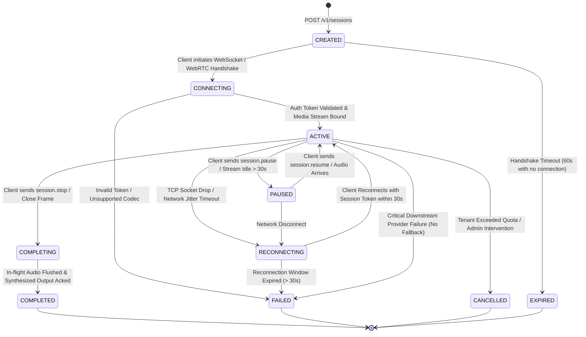

# VoxBridge AI — Real-Time Session Architecture & Lifecycle

## 1. Session Lifecycle State Machine (Mermaid Diagram 9)

Real-time audio streams operate under strict deterministic state machine governance. Sessions transition across deterministic states to ensure zero resource leakage, accurate billing boundaries, and transparent client reconnects.



---

## 2. Session Data Structure & Persistent State

Session records are initialized in PostgreSQL for auditability and mirrored into Redis Cluster with sub-millisecond retrieval keys:

```go
type RealtimeSession struct {
    SessionID        string            `json:"session_id"`        // Format: sess_01J8V3M4K5...
    ConnectionID     string            `json:"connection_id"`     // Format: conn_01J8V3M4K5...
    TenantID         string            `json:"tenant_id"`
    ProjectID        string            `json:"project_id"`
    UserID           string            `json:"user_id,omitempty"`
    
    // Linguistic & Audio Configuration
    SourceLanguage   string            `json:"source_language"`
    TargetLanguages  []string          `json:"target_languages"`
    AudioFormat      AudioConfig       `json:"audio_format"`
    VoiceID          string            `json:"voice_id"`
    
    // Model & Routing Allocations
    AssignedSTT      string            `json:"assigned_stt_provider"`
    AssignedNMT      string            `json:"assigned_nmt_provider"`
    AssignedTTS      string            `json:"assigned_tts_provider"`
    EdgeRegion       string            `json:"edge_region"`
    
    // Sequence & Reconnection State
    LastClientSeq    uint64            `json:"last_client_seq"`
    LastServerSeq    uint64            `json:"last_server_seq"`
    LastAckedSeq     uint64            `json:"last_acked_seq"`
    
    // Lifecycle & Timestamps
    Status           SessionStatus     `json:"status"`
    CreatedAt        time.Time         `json:"created_at"`
    ExpiresAt        time.Time         `json:"expires_at"`
    CompletedAt      *time.Time        `json:"completed_at,omitempty"`
    
    // Usage Accumulator (In-Flight)
    AudioSecondsTotal float64          `json:"audio_seconds_total"`
    CharactersTotal   int64            `json:"characters_total"`
    Metadata         map[string]string `json:"metadata,omitempty"`
}
```

---

## 3. Reconnection & Seamless Stream Resumption

When a mobile client passes through an elevator or switches from Wi-Fi to 5G cellular, the underlying TCP connection abruptly drops. VoxBridge guarantees zero audio frame loss via an **Idempotent 30-Second Resume Window**:

```
 [CLIENT (Mobile)]                                   [STREAMING GATEWAY]
        │                                                     │
        │─── WebSocket Connection Abruptly Drops ────────────►│ (Detects Socket EOF)
        │                                                     ▼
        │                                       [Enters RECONNECTING State]
        │                                       - Closes STT streaming frame pipe
        │                                       - Preserves session in Redis (TTL: 30s)
        │                                       - Holds un-acked event replay ring buffer
        │                                                     │
   (Network Restored)                                         │
        │                                                     │
        │─── WSS /v1/realtime ───────────────────────────────►│
        │    Header: X-Session-Token: vxt_...                 │
        │    Header: X-Resume-Last-Seq: 84                    │
        │                                                     │
        │◄── HTTP 101 Switching Protocols ────────────────────│
        │                                                     ▼
        │                                       [Validates Checkpoint]
        │◄── Event: session.resumed ──────────────────────────│
        │    Replaying Server Events (Seq 85 to 92)...        │
        │                                                     │
        │─── Resumes Streaming Audio Chunk (Seq 85) ─────────►│
        │                                                     ▼
        │                                       [ACTIVE State Restored]
```

### 3.1 Replay Ring Buffer Details
- Each active session maintains an in-memory 64-slot ring buffer of generated server events (transcripts, translations, audio chunk metadata).
- If the client's `X-Resume-Last-Seq` matches an item in the ring buffer, missing events are immediately re-transmitted in order without re-running STT or translation inference.
- If the client reconnects after the 30-second window has expired, the server terminates the handshake with RFC 6455 code `4408 Request Timeout` and emits `session.expired`.
