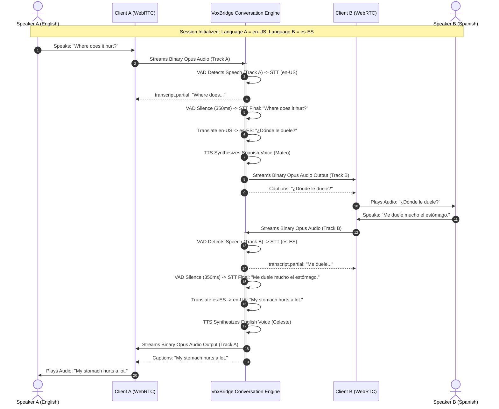

# VoxBridge AI — Conversational Engine & Two-Way Interpretation

## 1. Conversational Pipeline Flow (Mermaid Diagram 10)

Mode G (Two-Way Conversational Interpretation) coordinates bidirectional cross-language communication between two participants (e.g., a doctor speaking English and a patient speaking Spanish). Each speaker receives translated speech in their native language while maintaining conversation context across turns.

---

## 2. Decoupled Conversational State Architecture

Conversations must never be hard-coded or pinned in-memory to a single application container instance:
1. **Shared Session Context in Redis:** The conversation history (last 5 conversational turns, speaker IDs, active language bindings, and audio clock timestamps) is stored in Redis under `conversation:{session_id}:context`.
2. **Stateless Media Ingestion:** If Speaker A is connected to Streaming Gateway Pod 14 in Virginia and Speaker B is connected to Streaming Gateway Pod 08 in Frankfurt, the audio tracks are routed via internal NATS JetStream audio sub-channels (`voxbridge.media.session.{session_id}.track_a` and `track_b`), allowing seamless cross-region distributed interpretation.

---

## 3. Advanced Conversational Dynamics

### 3.1 Interruption Handling & Barge-In Detection
In natural human conversation, speakers interrupt one another:
- **Scenario:** While Speaker A's translated voice is currently playing through Speaker B's speaker, Speaker B starts speaking.
- **Barge-In Mitigation Pipeline:**
  1. Local Acoustic Echo Cancellation (AEC) running on Client B's SDK strips out the sound of Speaker A coming from the phone speaker.
  2. The VAD engine on Track B detects active voice energy ($P(\text{speech}) \ge 0.55$) from Speaker B.
  3. The Conversation Engine immediately dispatches an `audio.interrupt` control frame to Client B, which **instantly mutes/fades out** the playing TTS audio within 50ms.
  4. The engine halts downstream TTS synthesis for Speaker A's remaining queue and shifts priority to transcribing Speaker B's incoming utterance.

### 3.2 Multi-Speaker Diarization in Meeting Mode (Mode H)
In multi-party conferences (3 to 50 attendees):
- **Speaker Embedding Extraction:** A 192-dimensional ECAPA-TDNN neural embedding is extracted from the first 500ms of every new voice.
- **Cosine Clustering:** Embeddings are clustered against active participant profiles to assign stable speaker tags (`speaker_0`, `speaker_1`, `speaker_2`).
- **Individual Audio Track Isolation:** WebRTC selective forwarding units (SFU) isolate individual microphone tracks, completely eliminating acoustic overlap before transcription.
