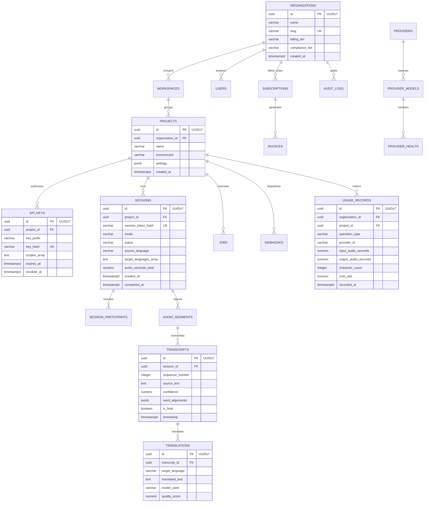

# VoxBridge AI — Relational Database Architecture & Schema Design

## 1. Entity-Relationship Diagram (Mermaid Diagram 13)

The PostgreSQL 18 relational schema serves as the immutable system of record for tenancy, security, sessions, linguistic assets, billing, and system configurations.



---

## 2. Key Identifier Strategy: UUIDv7 vs. B-Tree Fragmentation

Traditional random UUIDv4 identifiers cause catastrophic page-split fragmentation in PostgreSQL B-Tree indexes at scale (millions of rows inserted per hour), degrading disk I/O. 

**VoxBridge Mandate:** All primary keys strictly utilize **UUIDv7 (RFC 9562)**:
- **Structure:** 48-bit millisecond Unix epoch timestamp + 12-bit monotonic counter + 62 bits of cryptographically secure pseudo-random entropy.
- **Benefits:** Strictly time-sortable (sequential writes append to the rightmost B-Tree leaf node); enables rapid time-range queries without separate index lookups; zero central coordination required across distributed nodes.

---

## 3. High-Volume DDL Specifications & Indexing Strategies

### 3.1 Tenancy & Authentication Tables
```sql
-- 1. Organizations (Root Tenant Boundary)
CREATE TABLE organizations (
    id UUID PRIMARY KEY, -- UUIDv7
    name VARCHAR(128) NOT NULL,
    slug VARCHAR(64) NOT NULL UNIQUE,
    billing_email VARCHAR(255) NOT NULL,
    billing_tier VARCHAR(32) NOT NULL DEFAULT 'DEVELOPER', -- FREE, DEVELOPER, PRO, ENTERPRISE
    compliance_tier VARCHAR(32) NOT NULL DEFAULT 'STANDARD', -- STANDARD, HIPAA, SOC2_STRICT
    default_data_region VARCHAR(32) NOT NULL DEFAULT 'us-east-1',
    is_suspended BOOLEAN NOT NULL DEFAULT FALSE,
    created_at TIMESTAMPTZ NOT NULL DEFAULT CLOCK_TIMESTAMP(),
    updated_at TIMESTAMPTZ NOT NULL DEFAULT CLOCK_TIMESTAMP()
);

-- 2. Projects (Resource & Cost Grouping)
CREATE TABLE projects (
    id UUID PRIMARY KEY,
    organization_id UUID NOT NULL REFERENCES organizations(id) ON DELETE CASCADE,
    name VARCHAR(128) NOT NULL,
    environment VARCHAR(32) NOT NULL DEFAULT 'PRODUCTION', -- PRODUCTION, STAGING, DEVELOPMENT
    retention_days INTEGER NOT NULL DEFAULT 30,
    zero_retention_mode BOOLEAN NOT NULL DEFAULT FALSE,
    created_at TIMESTAMPTZ NOT NULL DEFAULT CLOCK_TIMESTAMP()
);
CREATE INDEX idx_projects_org_id ON projects(organization_id);

-- 3. API Keys (High-Security Credential Store)
CREATE TABLE api_keys (
    id UUID PRIMARY KEY,
    project_id UUID NOT NULL REFERENCES projects(id) ON DELETE CASCADE,
    name VARCHAR(64) NOT NULL,
    key_prefix VARCHAR(16) NOT NULL,
    key_hash VARCHAR(64) NOT NULL UNIQUE, -- SHA-256 hex digest
    scopes TEXT[] NOT NULL DEFAULT '{"session:create","session:stream"}',
    allowed_cidrs INET[] DEFAULT NULL,
    allowed_origins TEXT[] DEFAULT NULL,
    created_at TIMESTAMPTZ NOT NULL DEFAULT CLOCK_TIMESTAMP(),
    expires_at TIMESTAMPTZ DEFAULT NULL,
    revoked_at TIMESTAMPTZ DEFAULT NULL
);
CREATE INDEX idx_api_keys_lookup ON api_keys(key_hash) WHERE revoked_at IS NULL;
```

### 3.2 Real-Time Session & Linguistic Assets
```sql
-- 4. Real-Time Sessions
CREATE TABLE sessions (
    id UUID PRIMARY KEY,
    project_id UUID NOT NULL REFERENCES projects(id) ON DELETE RESTRICT,
    mode VARCHAR(32) NOT NULL, -- SPEECH_TO_TEXT, REALTIME_TRANSLATED_SPEECH, etc.
    status VARCHAR(32) NOT NULL DEFAULT 'CREATED',
    source_language VARCHAR(16) NOT NULL,
    target_languages TEXT[] NOT NULL,
    audio_codec VARCHAR(16) NOT NULL,
    sample_rate_hz INTEGER NOT NULL,
    audio_seconds_total NUMERIC(10, 3) NOT NULL DEFAULT 0.000,
    created_at TIMESTAMPTZ NOT NULL DEFAULT CLOCK_TIMESTAMP(),
    completed_at TIMESTAMPTZ DEFAULT NULL
);
CREATE INDEX idx_sessions_project_created ON sessions(project_id, created_at DESC);

-- 5. Transcripts (TimescaleDB / Declarative Range Partitioned)
CREATE TABLE transcripts (
    id UUID NOT NULL,
    session_id UUID NOT NULL,
    project_id UUID NOT NULL,
    sequence_number INTEGER NOT NULL,
    source_text TEXT NOT NULL,
    confidence NUMERIC(4, 3) NOT NULL,
    word_alignments JSONB DEFAULT NULL,
    is_final BOOLEAN NOT NULL DEFAULT TRUE,
    created_at TIMESTAMPTZ NOT NULL,
    PRIMARY KEY (id, created_at)
) PARTITION BY RANGE (created_at);

-- Monthly partition template
CREATE TABLE transcripts_2026_09 PARTITION OF transcripts
    FOR VALUES FROM ('2026-09-01 00:00:00+00') TO ('2026-10-01 00:00:00+00');
CREATE INDEX idx_transcripts_sess_seq ON transcripts_2026_09(session_id, sequence_number);
```

### 3.3 High-Throughput Usage Metering (TimescaleDB Hypertable)
```sql
-- 6. Usage Records (Write-Heavy Append-Only Table)
CREATE TABLE usage_records (
    id UUID NOT NULL,
    organization_id UUID NOT NULL,
    project_id UUID NOT NULL,
    session_id UUID DEFAULT NULL,
    operation_type VARCHAR(32) NOT NULL, -- STT_STREAMING, MT_TOKENS, TTS_SYNTHESIS
    provider_id VARCHAR(64) NOT NULL,
    model_id VARCHAR(64) NOT NULL,
    input_audio_seconds NUMERIC(10, 3) DEFAULT 0.000,
    output_audio_seconds NUMERIC(10, 3) DEFAULT 0.000,
    character_count INTEGER DEFAULT 0,
    token_count INTEGER DEFAULT 0,
    unit_cost_usd NUMERIC(12, 8) NOT NULL,
    total_cost_usd NUMERIC(10, 6) NOT NULL,
    recorded_at TIMESTAMPTZ NOT NULL
);

-- Convert to hypertable partitioned into 7-day chunks
SELECT create_hypertable('usage_records', 'recorded_at', chunk_time_interval => INTERVAL '7 days');
CREATE INDEX idx_usage_org_time ON usage_records(organization_id, recorded_at DESC);
```

---

## 4. Partitioning & Automated Lifecycle Archival

| Table Name | Partition Strategy | Chunk / Partition Size | Hot Storage Retention | Cold S3 Archival Rule | Hard Deletion Guarantee |
|---|---|---|---|---|---|
| `transcripts` | Declarative PostgreSQL Range | Monthly (`INTERVAL '1 month'`) | 90 Days | Parquet export to S3 bucket | Automated purge after tenant `retention_days` |
| `usage_records`| TimescaleDB Hypertable | Weekly (`INTERVAL '7 days'`) | 365 Days | Compressed columnar chunk compression | Retained 7 years for tax/financial audit |
| `audit_logs` | TimescaleDB Hypertable | Monthly (`INTERVAL '1 month'`) | 180 Days | Immutable S3 Glacier Vault Lock | WORM compliance (cannot be deleted prior to 7 years) |
