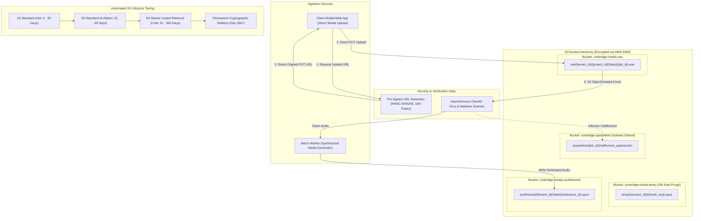

# VoxBridge AI — Object Storage & Media Lifecycle Architecture

## 1. Object Storage Architecture Topology (Mermaid Diagram 15)

VoxBridge AI utilizes an enterprise S3-compatible object storage topology (AWS S3 / Cloudflare R2 / MinIO) partitioned by tenant security boundaries, automated lifecycle expiration tiers, virus scanning, and pre-signed cryptographic access control.



---

## 2. Bucket Taxonomy & Key Naming Conventions

All media assets are strictly separated across dedicated physical buckets with standardized URI key prefixes:

```
s3://voxbridge-media-raw/
└── tenants/
    └── {tenant_uuid}/
        └── projects/
            └── {project_uuid}/
                └── year=2026/month=09/day=19/
                    └── {job_uuid}/
                        └── original_input.wav

s3://voxbridge-media-synthesized/
└── tenants/
    └── {tenant_uuid}/
        └── projects/
            └── {project_uuid}/
                └── year=2026/month=09/day=19/
                    └── {job_uuid}/
                        ├── translated_es_ES.opus
                        └── translated_hi_IN.opus

s3://voxbridge-media-temp/
└── sessions/
    └── {session_uuid}/
        └── chunk_000042.opus
```

---

## 3. Pre-Signed URL Cryptographic Governance

To ensure zero media streaming bottlenecks on backend API pods, clients upload large audio files directly to object storage via **AWS S3 Pre-Signed URLs**:

1. **Short Expiration Window:** Pre-signed URLs strictly expire within **15 minutes (900 seconds)**.
2. **Method & Header Binding:** Signed URLs enforce exact HTTP methods (`PUT`), exact `Content-Type` headers (`audio/wav`, `audio/ogg`), and an explicit upper boundary on `Content-Length` (`max 524,288,000 bytes` or 500 MB).
3. **No Public Bucket Access:** All S3 buckets enforce `BlockPublicAcls = true`, `BlockPublicPolicy = true`, `IgnorePublicAcls = true`, and `RestrictPublicBuckets = true`.

---

## 4. Encryption & Customer-Managed Keys (CMK)

- **Default Encryption:** All objects are encrypted at rest via **SSE-KMS** using an AWS KMS Key with automated annual rotation.
- **BYOK (Bring Your Own Key) for Enterprise:** Enterprise clients can provide an external AWS KMS Key ARN or Google Cloud KMS Key ID. Every read/write operation decrypts/encrypts using the tenant's dedicated key. If the client revokes the key in their cloud console, all access to their historical media is instantly rendered cryptographically inaccessible.

---

## 5. Privacy Safeguards & Zero-Retention Mode

When a tenant enables `zero_retention_mode: true`:
1. **No Disk Writes:** Streaming audio frames are decoded in Linux RAM buffers (`tmpfs` /dev/shm) and discarded immediately upon STT tokenization.
2. **Zero Permanent Audio Persistence:** Neither raw user speech nor synthesized target speech is written to S3 buckets. Only transient in-memory ring buffers handle the playback stream.
3. **Automated Audit Attestation:** Emits a signed audit record verifying that zero bytes were persisted to persistent disks.
