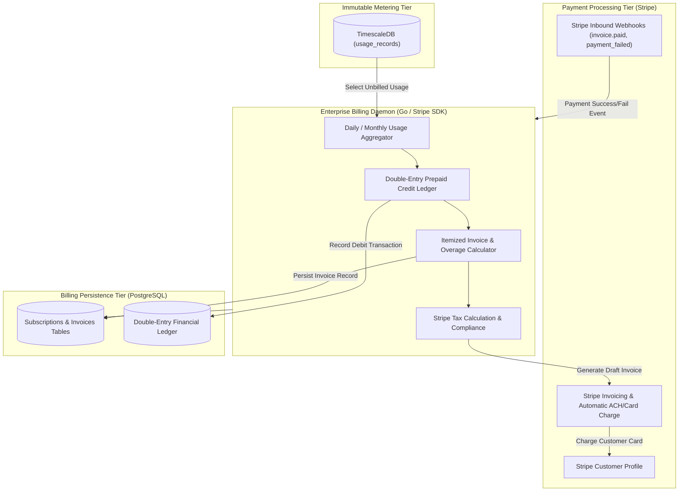

# VoxBridge AI — Enterprise Billing Architecture & Financial Reconciliation

## 1. Billing Pipeline Topology (Mermaid Diagram 21)

The Billing Architecture orchestrates subscription lifecycles, real-time prepaid credit deductions, automated post-paid invoicing via Stripe, tax compliance, and automated financial reconciliation.



---

## 2. Subscription Pricing Tiers & Unit Economics

| Plan Name | Base Monthly Fee | Included Audio Minutes | Overage per Audio Minute | Included Translation Characters | Overage per 10k Chars | Max Concurrency |
|---|---|---|---|---|---|---|
| **Free Sandbox** | $0 / mo | 60 Mins | N/A (Hard cutoff) | 100,000 Chars | N/A (Hard cutoff) | 2 Sessions |
| **Developer** | $49 / mo | 500 Mins | $0.08 / min | 1,000,000 Chars | $0.15 | 10 Sessions |
| **Pro** | $249 / mo | 3,000 Mins | $0.065 / min | 6,000,000 Chars | $0.12 | 50 Sessions |
| **Business** | $999 / mo | 15,000 Mins | $0.050 / min | 35,000,000 Chars | $0.09 | 250 Sessions |
| **Enterprise** | Custom ($5k+ / mo) | Custom Pool | Negotiated ($0.02 - $0.035) | Custom Pool | Negotiated | Unlimited (Dedicated GPUs) |

### 2.1 Unit Economics & Gross Margins
- **Self-Hosted Infrastructure Cost per Audio Minute:**
  $$\text{Compute (GPU A10G)} \approx \$0.0035 + \text{Network Bandwidth} \approx \$0.0004 = \mathbf{\$0.0039 / \text{min}}.$$
- **Blended Cloud Provider Fallback Cost:** $\approx \$0.024 / \text{min}$.
- **Customer Sale Price (Pro Plan):** $\$0.065 / \text{min}$.
- **Gross Profit Margin:** $\ge \mathbf{82\%}$ when routed to self-hosted workers; $\ge \mathbf{63\%}$ under cloud fallback.

---

## 3. Double-Entry Prepaid Credit Ledger

For prepaid developer accounts, balances are managed via an immutable double-entry ledger to prevent phantom balance bugs or race conditions:

```sql
CREATE TABLE financial_ledger (
    id UUID PRIMARY KEY, -- UUIDv7
    organization_id UUID NOT NULL REFERENCES organizations(id),
    account_type VARCHAR(32) NOT NULL, -- PREPAID_BALANCE, REVENUE, UNBILLED_OVERAGE
    entry_type VARCHAR(16) NOT NULL, -- DEBIT, CREDIT
    amount_usd NUMERIC(12, 4) NOT NULL,
    reference_id UUID NOT NULL, -- References usage_record_id OR stripe_charge_id
    description TEXT NOT NULL,
    created_at TIMESTAMPTZ NOT NULL DEFAULT CLOCK_TIMESTAMP()
);

-- Invariant Constraint: Sum of debits must equal sum of credits across system
```

---

## 4. Automated Daily Reconciliation Engine

Every 24 hours at 02:00 UTC, a reconciliation job verifies consistency between three independent sources of financial truth:
1. The raw count of audio seconds recorded in `usage_records` (TimescaleDB).
2. The debit entries posted to `financial_ledger` (PostgreSQL).
3. The total pending usage meters reported to Stripe.

If a discrepancy exceeds **$5.00 or 0.01%**, the system emits a critical Sev-2 alert (`BillingReconciliationDiscrepancy`), suspends automated invoice finalization, and flags the tenant account for manual SRE review.
