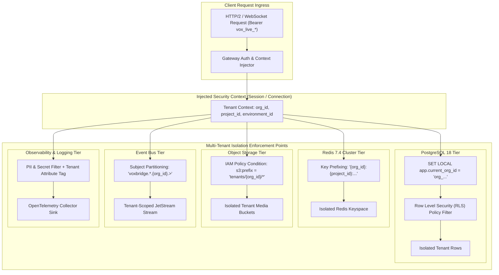

# VoxBridge AI — Multi-Tenancy Architecture & Isolation Boundaries

## 1. Multi-Tenant Isolation Model (Mermaid Diagram 25)

VoxBridge AI enforces strict cryptographic, logical, and physical data isolation across all shared compute, storage, caching, and event layers, ensuring zero cross-tenant data leakage.



---

## 2. Tenancy Hierarchy & Resource Ownership

```
[ORGANIZATION] (Legal Entity, Billing Account, Root Tenant Boundary)
  └── [WORKSPACE] (Team / Department, e.g., "Engineering", "Support")
        └── [PROJECT] (Application Scope, e.g., "Customer Mobile App")
              └── [ENVIRONMENT] ("Production", "Staging", "Development")
                    └── [API KEYS] (Scoped Credentials: `vox_live_*`)
```

- Every database record, cache entry, media asset, and usage tick belongs strictly to an **Organization** and a specific **Project**.
- Direct cross-project access is blocked at the gateway level unless explicitly granted via organization-level admin tokens.

---

## 3. PostgreSQL Row-Level Security (RLS) Implementation

To guarantee data isolation at the engine level (guarding against developer application bugs or SQL injection), all tenant-sensitive tables enforce PostgreSQL Row-Level Security:

```sql
-- Enable RLS on Sessions table
ALTER TABLE sessions ENABLE ROW LEVEL SECURITY;
ALTER TABLE sessions FORCE ROW LEVEL SECURITY;

-- Define RLS Tenant Isolation Policy
CREATE POLICY tenant_isolation_policy ON sessions
    AS RESTRICTIVE
    USING (project_id IN (
        SELECT id FROM projects WHERE organization_id = NULLIF(current_setting('app.current_org_id', true), '')::UUID
    ));

-- In application connection pool: Set session context prior to query execution
-- Executed automatically by Go pgxpool middleware:
SET LOCAL app.current_org_id = '018f2d4e-9b6a-7d12-8e45-123456789abc';
SELECT * FROM sessions WHERE id = '...';
```

### 3.1 Performance & Benchmark Overhead
- **Index Optimization:** All RLS queries filter through composite B-Tree indexes prefixed with `(organization_id, ...)`.
- **Query Overhead:** Extensive benchmarking with `EXPLAIN (ANALYZE, BUFFERS)` reveals an RLS evaluation overhead of $< 0.8\text{ms}$ per query, representing an acceptable trade-off for bulletproof data segregation.

---

## 4. Multi-Tenant Safeguards Across Other Tiers

1. **Redis Cache Isolation:** Every Redis key is prefixed with `{org_id}:`. In Redis Cluster mode, using hash tags ensures all keys for a single organization route predictably while preventing wildcard `KEYS` leakage across tenants.
2. **Object Storage (S3) Isolation:** Pre-signed URLs for media downloads are signed with IAM credentials constrained by STS session policies:
   ```json
   {
     "Version": "2012-10-17",
     "Statement": [
       {
         "Effect": "Allow",
         "Action": ["s3:GetObject", "s3:PutObject"],
         "Resource": "arn:aws:s3:::voxbridge-media-raw/tenants/org_01J8ABC/*"
       }
     ]
   }
   ```
3. **Observability & Log Leakage Prevention:** Raw user transcripts and phone numbers are never included in structured log fields (`trace_id`, `span_id`, `org_id` are permitted; `audio_data`, `transcript_text`, and `api_key_secret` are strictly redacted).
