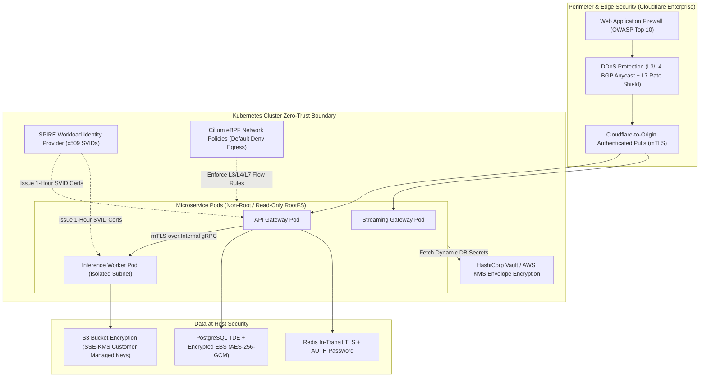

# VoxBridge AI — Enterprise Security & Cryptographic Architecture

## 1. Security Architecture Topology (Mermaid Diagram 16)

VoxBridge AI enforces a comprehensive Zero-Trust security posture spanning network edge filtering, perimeter authentication, cryptographic workload identity, envelope data encryption, and software supply chain protection.



---

## 2. Cryptographic Key Management & Secret Protection

### 2.1 API Key Hashing Standards
Raw API secrets (`vox_live_...`) are generated with 256 bits of cryptographically secure random entropy.
- **Plaintext Secret Exposure:** Displayed **exactly once** in the dashboard UI upon creation.
- **Persistence Standard:** Hashed using **SHA-256 with a global HMAC server salt** before writing to PostgreSQL:
  $$\text{Stored Hash} = \text{HMAC-SHA256}(\text{KeySecret}, \text{MasterSalt})$$
- **Timing-Attack Immunity:** Database verification executes using constant-time string comparison (`subtle.ConstantTimeCompare` in Go).

### 2.2 Workload Identity via SPIFFE/SPIRE
Internal microservices do not use static long-lived credentials to communicate with one another:
- Every Kubernetes pod is issued an ephemeral **SPIFFE Verifiable Identity Document (SVID)** x509 certificate with a 1-hour time-to-live.
- All internal gRPC calls automatically negotiate bidirectional mTLS with mutual certificate validation. If a compromised pod attempts to call an unauthorized service, the network handshake is rejected at the transport layer.

---

## 3. Envelope Encryption with AWS KMS

All media files and sensitive customer database fields (such as enterprise glossary terms) are protected via **Envelope Encryption**:

```
 [PLAINTEXT DATA] ──────► [AES-256-GCM Encryption] ──────► [ENCRYPTED CIPHERTEXT]
                                ▲
                                │ Encrypts with DEK
                     ┌──────────┴──────────┐
                     │ Data Encryption Key │ (Generated in RAM, never saved)
                     │       (DEK)         │
                     └──────────┬──────────┘
                                │
                                ▼ AWS KMS GenerateDataKey API
                     ┌─────────────────────┐
                     │  Customer Root Key  │ (Hardware Security Module HSM)
                     │       (CMK)         │
                     └──────────┬──────────┘
                                │
                                ▼
                     [ENCRYPTED DEK BLOB] (Stored alongside ciphertext)
```

---

## 4. Software Supply Chain Security & Container Hardening

1. **Distroless Non-Root Containers:** All production containers run on Google Distroless or minimal Alpine scratch images. Container processes execute under `UID 10001 (non-root)` with `readOnlyRootFilesystem = true` and `allowPrivilegeEscalation = false`.
2. **Automated Vulnerability Gate:** CI/CD pipelines run **Trivy** and **Grype** scanning. Builds containing any unpatched CVE with a CVSS score $\ge 7.0$ (High/Critical) fail the deployment automatically.
3. **Software Bill of Materials (SBOM):** Every container build generates a CycloneDX and SPDX SBOM signed via **Sigstore / Cosign**. Production Kubernetes clusters reject unsigned container images via Kyverno admission controller policies.
