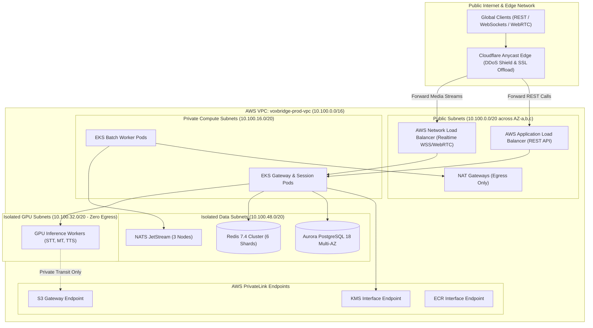

# VoxBridge AI — Network Topology & Enterprise Transit Architecture

## 1. Network Topology (Mermaid Diagram 17)

The Network Architecture illustrates the multi-tier VPC zoning, perimeter routing, load balancer separation, AWS Transit Gateway connectivity, and zero-egress private subnets protecting internal speech models.

---

## 2. VPC Subnet Allocation Matrix

| Subnet Group | CIDR Block | Usable IPs | Internet Gateway Routing | Egress NAT Allowed | Target Workload Types |
|---|---|---|---|---|---|
| **Public DMZ** | `10.100.0.0/20` | 4,096 | Inbound via IGW | Yes | ALB, NLB, Elastic IPs, NAT Gateways |
| **Private App** | `10.100.16.0/20` | 4,096 | None (Private) | Yes (via NAT) | API Gateway, Session Manager, Batch Workers |
| **Private GPU** | `10.100.32.0/20` | 4,096 | None (Strict Isolated)| **NO (Zero Egress)** | C++ TensorRT Whisper, vLLM NLLB Workers |
| **Private Data**| `10.100.48.0/20` | 4,096 | None (Strict Isolated)| **NO** | Aurora PostgreSQL, Redis Cluster, NATS |

---

## 3. Network Performance & Audio MTU Optimization

1. **Jumbo Frames inside VPC (MTU 9001):** Internal communication between the Streaming Gateway and GPU inference workers enables AWS Jumbo Frames (MTU 9001). This reduces CPU packet processing overhead by $70\%$ when streaming high-bandwidth uncompressed PCM audio chunks between pods.
2. **WAN Path MTU Discovery (PMTUD):** Outer edge connections to client mobile browsers strictly enforce standard Ethernet MTU (1500 bytes) with a clamping MSS of 1452 bytes, preventing packet fragmentation on cellular LTE/5G networks.
3. **AWS PrivateLink Endpoints:** S3, AWS Secrets Manager, ECR, and KMS traffic never leaves the Amazon network backbone, avoiding internet transit charges and eliminating public exposure vectors.
