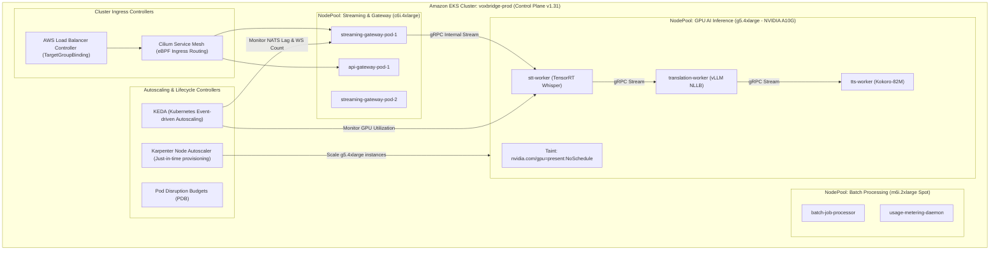

# VoxBridge AI — Enterprise Kubernetes (EKS) Infrastructure

## 1. Kubernetes Cluster Topology (Mermaid Diagram 18)

VoxBridge AI runs on **Amazon EKS v1.31** orchestrated with Cilium eBPF CNI, Karpenter node provisioning, NVIDIA GPU Operator, and KEDA event-driven autoscaling.



---

## 2. NodePool Definitions & Taint Strategy

### 2.1 GPU NodePool Configuration
```yaml
apiVersion: karpenter.sh/v1beta1
kind: NodePool
metadata:
  name: gpu-inference-nodepool
spec:
  template:
    spec:
      requirements:
        - key: "node.kubernetes.io/instance-type"
          operator: In
          values: ["g5.4xlarge", "g5.8xlarge"]
        - key: "karpenter.sh/capacity-type"
          operator: In
          values: ["on-demand"] # Zero spot interruption for live interactive streams
      taints:
        - key: "nvidia.com/gpu"
          value: "present"
          effect: "NoSchedule"
      nodeClassRef:
        name: gpu-ami-al2023
```

### 2.2 Pod Deployment Toleration & Resource Limits
```yaml
apiVersion: apps/v1
kind: Deployment
metadata:
  name: stt-inference-worker
  namespace: voxbridge-core
spec:
  replicas: 8
  template:
    metadata:
      labels:
        app: stt-inference-worker
    spec:
      tolerations:
        - key: "nvidia.com/gpu"
          operator: "Equal"
          value: "present"
          effect: "NoSchedule"
      containers:
        - name: whisper-engine
          image: 123456789012.dkr.ecr.us-east-1.amazonaws.com/voxbridge/whisper-trt:v2.4.0
          resources:
            requests:
              cpu: "6"
              memory: "16Gi"
              nvidia.com/gpu: "1"
            limits:
              cpu: "12"
              memory: "24Gi"
              nvidia.com/gpu: "1"
          securityContext:
            readOnlyRootFilesystem: true
            allowPrivilegeEscalation: false
            runAsNonRoot: true
            runAsUser: 10001
```

---

## 3. Pod Disruption Budgets & Graceful Socket Draining

Live voice calls must not be killed abruptly during rolling deployments or Kubernetes node upgrades:

```yaml
apiVersion: policy/v1
kind: PodDisruptionBudget
metadata:
  name: streaming-gateway-pdb
  namespace: voxbridge-core
spec:
  minAvailable: 80%
  selector:
    matchLabels:
      app: streaming-gateway
```

### 3.1 Graceful Termination Lifecycle Handler (`SIGTERM`)
1. **Deregister from Load Balancer:** The pod marks its readiness probe as `FAILED` immediately, stopping new inbound connections from the AWS Network Load Balancer.
2. **Send WebSocket Restart Notice:** Broadcasts an RFC 6455 `1012 Service Restart` control frame to all connected clients with a randomized 0 to 10-second reconnect delay.
3. **Flushes Active Media:** Allows active in-flight utterances to complete translation and emit audio chunks (up to a hard `terminationGracePeriodSeconds: 300` window) before process termination.

---

## 4. KEDA Event-Driven Autoscaling

Naive CPU-based autoscaling fails on streaming media because audio transcoding and network I/O are I/O-bound, not CPU-bound. VoxBridge configures **KEDA** to scale on domain-specific workload signals:

```yaml
apiVersion: keda.sh/v1alpha1
kind: ScaledObject
metadata:
  name: streaming-gateway-scaler
  namespace: voxbridge-core
spec:
  scaleTargetRef:
    name: streaming-gateway
  minReplicaCount: 6
  maxReplicaCount: 50
  cooldownPeriod: 300
  triggers:
    - type: prometheus
      metadata:
        serverAddress: http://prometheus-k8s.monitoring.svc:9090
        metricName: active_websocket_connections
        query: sum(active_websocket_connections{app="streaming-gateway"})
        threshold: "2000" # Provision 1 pod per 2,000 active concurrent calls
```
