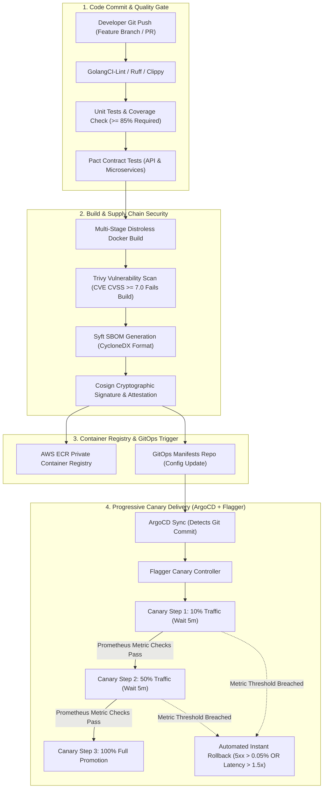

# VoxBridge AI — CI/CD Pipeline & Progressive GitOps Delivery

## 1. CI/CD Pipeline Flow (Mermaid Diagram 19)

VoxBridge AI enforces an automated, security-hardened delivery pipeline combining GitHub Actions for continuous integration and **ArgoCD + Flagger** for progressive canary GitOps deployments.



---

## 2. Quality & Security Gates in CI

Every pull request must successfully pass the following non-negotiable automated gates before merge approval:

1. **Test Coverage Barrier:** CI fails if global unit and integration test coverage drops below **85%**.
2. **Deterministic Contract Testing (Pact):** The API Gateway contract with internal services is verified via Pact tests. Breaking Protobuf or JSON schema changes fail the build before deployment.
3. **Container Security Gate (Trivy):**
   ```yaml
   - name: Run Trivy Vulnerability Scanner
     uses: aquasecurity/trivy-action@master
     with:
       image-ref: ${{ env.IMAGE_TAG }}
       format: 'table'
       exit-code: '1' # Fails CI on finding
       ignore-unfixed: true
       severity: 'CRITICAL,HIGH'
   ```
4. **Supply Chain Attestation (Cosign):** Images pushed to ECR are cryptographically signed using GitHub Actions OIDC identity. The Kyverno policy running in Kubernetes blocks any pod whose image lacks a valid Cosign signature.

---

## 3. Flagger Progressive Canary Configuration

```yaml
apiVersion: flagger.app/v1beta1
kind: Canary
metadata:
  name: streaming-gateway-canary
  namespace: voxbridge-core
spec:
  targetRef:
    apiVersion: apps/v1
    kind: Deployment
    name: streaming-gateway
  service:
    port: 8443
    targetPort: 8443
  analysis:
    interval: 1m
    threshold: 3 # Rollback after 3 consecutive failed checks
    maxWeight: 50
    stepWeight: 10
    metrics:
      - name: request-success-rate
        thresholdRange:
          min: 99.95
        interval: 1m
      - name: p95-latency
        thresholdRange:
          max: 0.850 # Fail if TTFA exceeds 850ms
        interval: 1m
```
