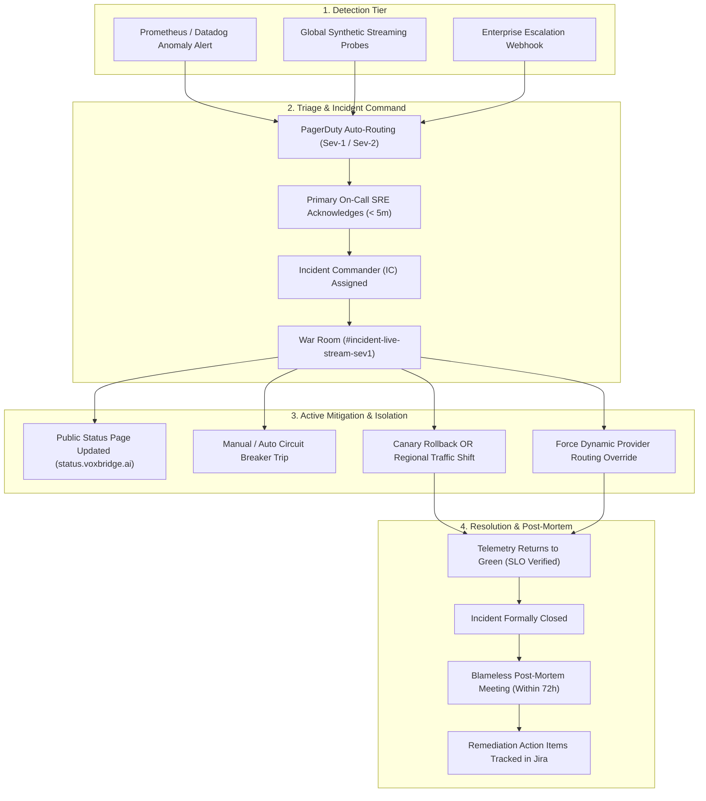

# VoxBridge AI — Incident Response & Failure Recovery Framework

## 1. Incident Lifecycle & Failure Recovery Workflow (Mermaid Diagram 24)

The Incident Response workflow establishes an automated, deterministic escalation path from telemetry anomaly detection to mitigation, customer communication, and blameless post-mortem resolution.



---

## 2. In-Session Live Audio Failure Handling Protocol

When an underlying speech engine crashes or times out in the middle of an active live phone call:

```
[LIVE AUDIO CALL IN PROGRESS]
              │
              ▼
   (In-Flight Speech Utterance Being Transcribed)
              │
              ▼
    [STT PROVIDER TIMEOUT (> 400ms) / 500 INTERNAL ERROR]
              │
              ▼
 1. INSTANT ISOLATION (< 15ms)
    - Stream Orchestrator marks provider as FAULTED.
    - Trips circuit breaker locally for the session.
              │
              ▼
 2. BUFFER PRESERVATION (< 20ms)
    - Ingested 16kHz PCM audio chunk is retained in the local session ring buffer.
    - Zero audio frames are dropped.
              │
              ▼
 3. SEAMLESS FALLBACK ROUTING (< 50ms)
    - Orchestrator replays buffered audio chunk to Fallback Provider (e.g., Azure Speech).
    - Preserves client sequence counter (`sequence_number = 42`).
              │
              ▼
 4. CLIENT NOTIFICATION & CAPABILITY TRANSPARENCY
    - Emits control event: `provider.changed` (transparency for audit).
    - If fallback operates with slightly lower quality or lacks word timestamps,
      client SDK adjusts UI captions gracefully.
              │
              ▼
 5. RESUMED AUDIO EMISSION
    - Translated text synthesized and streamed to client.
    - Total user-perceived stutter: < 200ms.
```

### 2.1 Unrecoverable Failure Exit Handshake
If all candidate providers fail and no fallback is reachable:
1. Emit `session.failed` control frame over WebSocket:
   ```json
   {
     "event_type": "session.failed",
     "error_code": "ALL_PROVIDERS_UNAVAILABLE",
     "message": "Speech pipeline failed across primary and fallback engines.",
     "session_id": "sess_01J8V3M4K5N6",
     "retryable": true,
     "resume_checkpoint_seq": 41
   }
   ```
2. Close WebSocket socket cleanly with RFC 6455 closure code `1011 (Internal Error)`.
